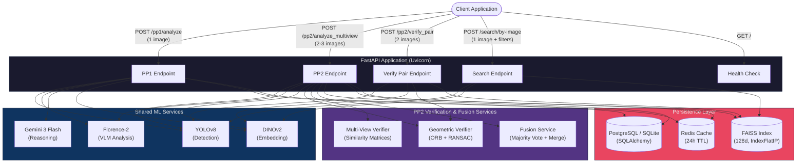
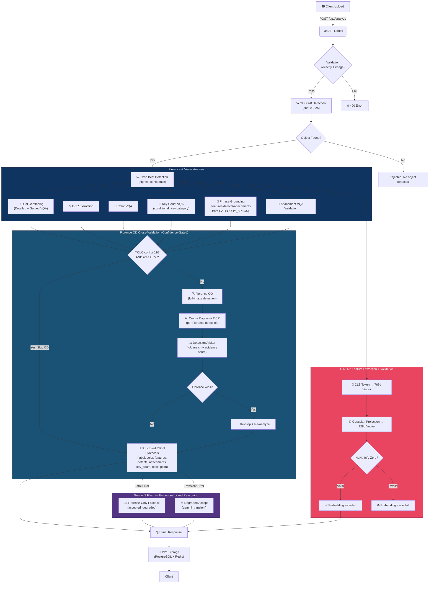
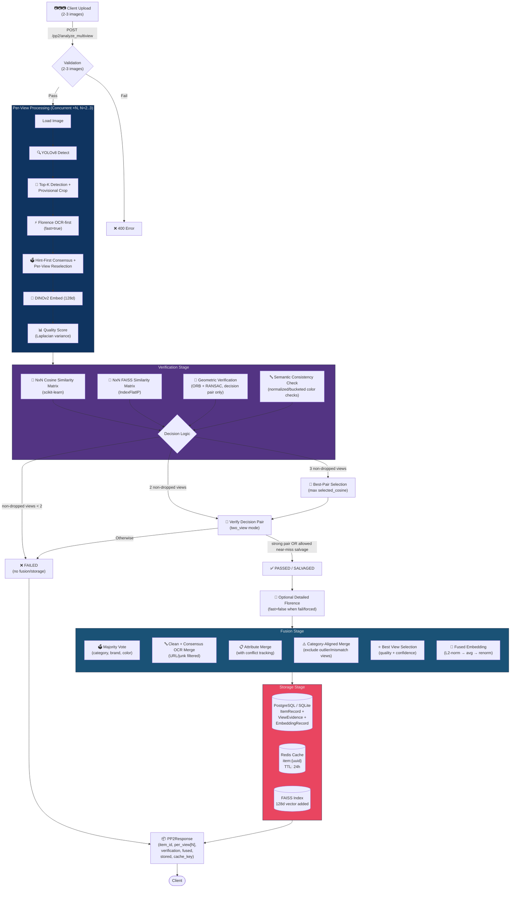
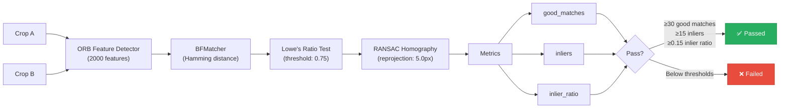
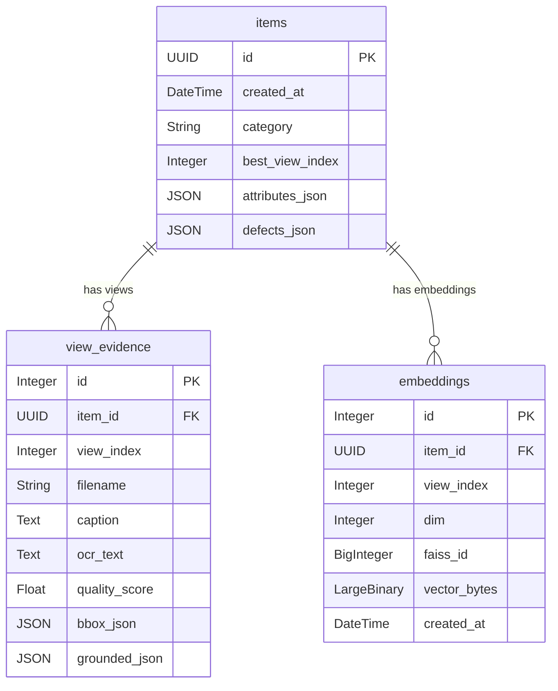
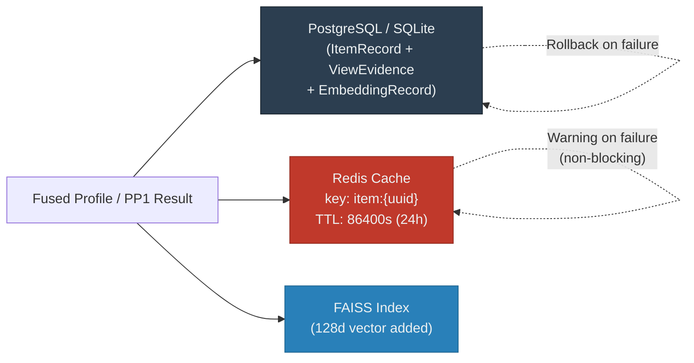
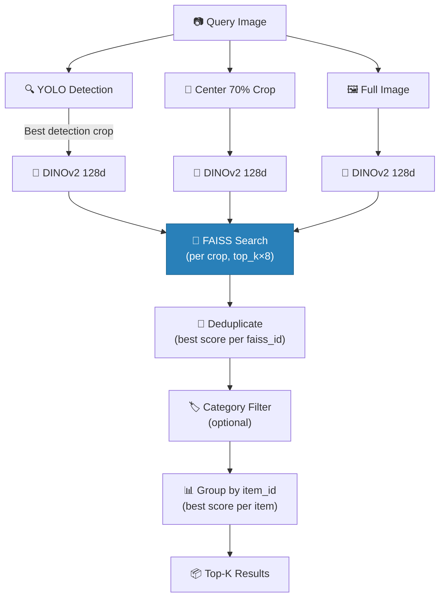
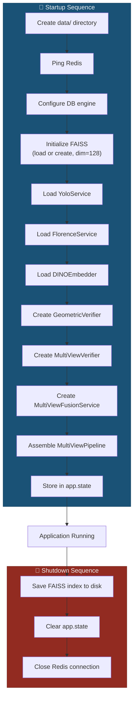

# Vision Core Backend — FindAssure

> **Image Processing & Object Recognition Pipeline** for the FindAssure Lost & Found System

A high-performance, multi-model hybrid AI backend that **detects**, **analyzes**, **verifies**, and **re-identifies** lost items through two complementary processing phases:

| Phase | Purpose | Input | Key Output |
|-------|---------|-------|------------|
| **PP1** — Single-Image Analysis | Detect an object, extract rich metadata, generate embeddings | 1 image | Structured item profile + DINOv2 embeddings |
| **PP2** — Multi-View Verification & Fusion | Verify 2-3 views show the same object, fuse results, persist to DB + FAISS | 2-3 images | Verified fused profile + FAISS-indexed embedding |

---

## Table of Contents

- [System Architecture](#-system-architecture)
- [Tech Stack](#-tech-stack)
- [ML Models](#-ml-models)
- [PP1 Pipeline — Single-Image Analysis](#-pp1-pipeline--single-image-analysis)
- [PP2 Pipeline — Multi-View Verification & Fusion](#-pp2-pipeline--multi-view-verification--fusion)
- [Geometric Verification](#-geometric-verification)
- [Multi-View Fusion](#-multi-view-fusion)
- [FAISS Vector Index](#-faiss-vector-index)
- [Category Specification System (SSOT)](#-category-specification-system-ssot)
- [Database Schema](#-database-schema)
- [Storage & Caching](#-storage--caching)
- [Search — Similarity Retrieval](#-search--similarity-retrieval)
- [API Reference](#-api-reference)
- [PP2 Response Schema](#-pp2-response-schema)
- [Application Lifecycle](#-application-lifecycle)
- [Project Structure](#-project-structure)
- [Round 4 — Multi-Angle Verification & Rescue Hardening](#-round-4--multi-angle-verification--rescue-hardening)
- [Setup & Installation](#-setup--installation)
- [Environment Variables](#-environment-variables)
- [Testing](#-testing)

---

## 🏗 System Architecture



---

## 🛠 Tech Stack

### Frameworks & Infrastructure

| Technology | Role |
|------------|------|
| **Python 3.10+** | Runtime |
| **FastAPI** | Async web framework |
| **Uvicorn** | ASGI server |
| **SQLAlchemy** | ORM (PostgreSQL / SQLite) |
| **psycopg2** | PostgreSQL driver |
| **Redis** (`redis-py`) | In-memory cache |
| **Pydantic Settings** | Configuration management (`.env` support) |

### Machine Learning & Computer Vision

| Technology | Role |
|------------|------|
| **PyTorch** + **Torchvision** | Deep learning backend |
| **Ultralytics** | YOLOv8 object detection |
| **Hugging Face Transformers** | Florence-2 / DINOv2 / SwinIR model inference |
| **Google GenAI SDK** | Gemini 3 Flash cloud API |
| **FAISS** (`faiss-cpu`) | Approximate nearest-neighbor vector search |
| **scikit-learn** | Cosine similarity matrices |
| **OpenCV** | ORB features, RANSAC homography, Laplacian quality |
| **Pillow** | Image I/O and basic enhancement |
| **timm** / **einops** | Model utilities |

---

## 🤖 ML Models

| Model | Role | Dimension | Status | Location |
|-------|------|-----------|--------|----------|
| **YOLOv8** (fine-tuned `final_master_model.pt`) | Object detection & localization (12 categories) | — | **Active** | `app/models/YoloV8n/` |
| **Florence-2** (Base-FT, local) | Captioning, OCR, VQA (color, defects, key count), phrase grounding | — | **Active** | `app/models/florence2-base-ft/` |
| **Florence-2** (Large-FT, local) | Extended VLM capacity | — | Available | `app/models/florence2-large-ft/` |
| **DINOv2** (`facebook/dinov2-base`) | Semantic embedding generation | 768d → 128d (Gaussian projection) | **Active** | `app/models/DINOv2/` |
| **Gemini 3 Flash** (Cloud API) | Evidence-locked reasoning & structured JSON synthesis | — | **Active** | Cloud (requires API key) |
| **SwinIR** | Image super-resolution / restoration | — | Placeholder (PIL enhancement) | `app/models/SwinIR/` |
| **LightGlue** (SuperPoint weights) | Learned feature matching | — | Weights present, **not integrated** | `app/models/LightGlue/` |
| **Qwen 2.5-VL** | Advanced VQA (drop-in Florence replacement) | — | Experimental, **not active** | `app/services/qwen_vl_service.py` |
| **Siamese Network** (ResNet-18 → 128d) | Pair-based re-identification | 128d | Architecture only, **not integrated** | `siamese_network.py` |

---

## 🔄 PP1 Pipeline — Single-Image Analysis

**Endpoint:** `POST /pp1/analyze` · **Input:** 1 image · **Orchestrator:** `app/services/unified_pipeline.py`

The PP1 pipeline takes a single image, detects objects, extracts rich visual evidence, reasons about the evidence using a cloud LLM, and generates embeddings for future similarity search.



### PP1 Detailed Steps

1. **Input Validation** — Requires exactly 1 uploaded image. File is saved to `temp_uploads/`, processed, then cleaned up.
2. **Detection (YOLOv8)** — The fine-tuned model scans the full image for objects across 12 categories. Raw label strings are normalized through `canonicalize_label()` (LRU-cached, 256 entries) to one of the `ALLOWED_LABELS` (e.g., `"cell phone"` → `"Smart Phone"`). Confidence threshold: `0.25`.
3. **Cropping** — The highest-confidence detection's bounding box is clamped to image bounds, and the region of interest (ROI) is extracted. A **minimum area gate** (0.5% of image area) rejects tiny noise detections before further processing.
4. **Visual Analysis (Florence-2)** — The `analyze_crop()` method runs a multi-task extraction. All subtask calls use a **retry-on-timeout** mechanism (1 retry attempt before failing):
   - **Dual Captioning** — Detailed caption + guided VQA caption, both sanitized to remove person/demographic references. **Guided VQA is skipped** when the detailed caption is already substantial (≥ 12 words), saving an inference call.
   - **Description Enrichment** — If the final description is very short (< 6 words), an additional VQA call produces a richer description.
   - **OCR** — Reads text (brand names, serial numbers, "VISA", ID numbers, etc.).
   - **Color VQA** — Asks "What is the dominant color of this object?"
   - **Key Count VQA** — Conditional: only for `Key` category, asks "How many keys?"
   - **Phrase Grounding** — Uses `CATEGORY_SPECS` to physically locate features, defects, and attachments with bounding boxes. Phrases are chunked to avoid prompt overflow.
   - **Attachment VQA Validation** — Verifies detected attachments via yes/no VQA.
5. **Florence OD Cross-Validation (Confidence-Gated)** — Skipped when YOLO top-1 confidence ≥ 0.92 and bounding box area ≥ 5% of image (saving ~500ms). Otherwise runs to cross-validate YOLO's detection. The `detect_and_describe()` method runs Florence `<OD>` on the full image, crops each canonical detection, and extracts per-crop captions + OCR. The **Detection Arbiter** (`detection_arbiter.py`) matches YOLO and Florence detections via IoU (threshold `0.3`) and scores keyword evidence from captions/OCR against `LABEL_EVIDENCE_KEYWORDS` for each of the 12 categories. If Florence's evidence score exceeds YOLO's, the arbiter declares Florence the winner — the pipeline re-crops and re-runs `analyze_crop()` with the corrected label and bounding box. Disabled when `FLORENCE_OD_FALLBACK_ENABLED=false`. The label rerank keywords include brand names and product aliases (e.g., "iphone", "macbook", "galaxy buds", "beats") for improved evidence scoring.
6. **Reasoning (Gemini 3 Flash)** — Receives the crop image + full evidence JSON. An **evidence-locked prompt** instructs Gemini to strictly synthesize (not hallucinate) structured JSON: `label`, `color`, `features`, `defects`, `attachments`, `key_count`, `description`.  
   - **Fatal error resilience (`GeminiFatalError`, e.g., 401/403):** Instead of rejecting the item, the pipeline builds a **Florence-only fallback** using color and description from Florence analysis. The item is returned with `status: "accepted_degraded"` and `message` indicating Florence-only processing.
   - **Transient error resilience (`GeminiTransientError`, e.g., 503):** Retried once, then accepted with `status: "accepted_degraded"` and `degradation_reason: "gemini_transient"`. The pipeline remains available without rejecting items.
7. **Embedding (DINOv2)** — The crop is embedded via the DINOv2 CLS token (768d), then projected to 128d via a deterministic random Gaussian matrix. Both vectors are **validated** (NaN, Inf, and all-zeros checks) before inclusion — invalid embeddings are logged and excluded. Both vectors are returned.
8. **PP1 Storage** — Items with `status: "accepted"` or `"accepted_degraded"` are persisted to **PostgreSQL** (ItemRecord + ViewEvidence + EmbeddingRecord) and cached in **Redis** (`item:{uuid}`, 24h TTL) immediately after processing.

---

## 🔄 PP2 Pipeline — Multi-View Verification & Fusion

**Endpoint:** `POST /pp2/analyze_multiview` · **Input:** 2-3 images · **Orchestrator:** `app/services/pp2_multiview_pipeline.py`

The PP2 pipeline improves re-identification accuracy by processing two or three different views of the same item. It runs a concurrent per-view stage-1 path with **full Florence OCR-first extraction** (`analyze_ocr_first(..., fast=True)`) plus DINO embeddings, excludes inconsistent views (outlier/mismatch), verifies the strongest eligible pair in `two_view` mode, and applies detailed Florence enrichment (`fast=False`) only on verification failure or when explicitly forced.



### PP2 Detailed Steps

#### Stage 1 — Per-View Processing (×N, N=2..3)

For each of the uploaded images (2 or 3):

| Step | Service | Details |
|------|---------|---------|
| **Load** | PIL | Convert `UploadFile` bytes → RGB `Image` |
| **Detect** | YOLOv8 | Collect top-K detections per view (`K=5`) via `detect_objects(..., max_detections=5)` |
| **Florence OCR-first** | Florence-2 | Run `analyze_ocr_first(..., fast=True)` on crop. Default attempt policy is one crop attempt plus one full-image fallback only when bbox is tiny/invalid. |
| **Hint + Reselect** | Pipeline | Infer canonical hint from OCR-first caption/OCR/features, compute cross-view hint-first consensus, reselect best top-K detection matching consensus (fallback top-1 marks `label_outlier=true`) |
| **Florence OD Cross-Validation** | Florence-2 + Arbiter | Always runs per-view. `detect_and_describe()` runs Florence `<OD>` on the full image and the Detection Arbiter compares YOLO vs Florence detections via IoU + evidence scoring. If Florence wins, the pipeline re-crops and re-runs `_call_ocr_first_once()` with the corrected label. |
| **Embed** | DINOv2 | `embed_128()` → 128d normalized vector (for verification) |
| **Quality** | OpenCV | Laplacian variance of grayscale crop (higher = sharper) |
| **Extraction (stage-1)** | Pipeline | `per_view[].extraction` stores OCR-first extraction and structured `raw.florence` metadata. Confidence is forced to `0.0` when `raw.florence.status="failed"`; early-exit skipped expensive steps are marked with `raw.skipped=true` and `raw.reason="early_exit"`. |

Cross-view detection selection is done in deterministic stages:
1. **Hint-first consensus**:
   - Build per-view `canonical_hint` from Florence OCR-first caption/OCR/grounded features using normalized label aliases.
   - If any hint receives `>=2` votes, use it (`hint_majority` strategy).
2. **YOLO fallback consensus** (when hint majority is absent):
   - Strict majority over top-1 labels.
   - Else coverage/confidence fallback ranking over top-K labels.
3. **Per-view final detection reselection**:
   - Pick highest-confidence top-K detection whose canonicalized label matches the consensus label.
   - If missing in that view, fallback to top-1 and mark that view as `label_outlier`.
   - Detection payload includes `selected_by` (`consensus_match`/`fallback_top1`), `outlier_view`, and optional `candidates` (raw/canonical/confidence/bbox).

#### Stage 2 — Verification

The `MultiViewVerifier` determines whether all input views depict the same physical object:

1. **Category- and Mode-Aware Thresholds** — `get_thresholds(mode, canonical_label)` resolves `(cos_th, faiss_th, near_miss_margin)` using group defaults with settings overrides:
   - `angle_hard`: `Helmet`, `Smart Phone`, `Laptop`, `Earbuds - Earbuds case`/`Earbuds`, `Power Bank`, `Headphone`
   - `texture_rich`: `Wallet`, `Handbag`, `Backpack`, `Umbrella`
   - `small_ambiguous`: `Keys`, `Student ID`, `Laptop Charger`
   - Legacy fallback uses `PP2_SIM_THRESHOLD` only when group/mode resolution is missing.
2. **Multi-Crop Pair Scoring** — each eligible view can include `full` and `center` (70%) embeddings; each pair uses the best path among:
   - `full/full`, `center/center`, `full/center`, `center/full`
   - selected by max `min(cosine, faiss)` with deterministic tie-break order above.
3. **Cosine Similarity Matrix** (NxN) — built from selected best-path cosine per pair.
4. **FAISS Similarity Matrix** (NxN) — built from selected best-path FAISS similarity per pair.
5. **Pre-verification exclusion + decision pair selection**:
   - Build `dropped_views` from views marked `outlier_view=true` and/or label mismatch vs consensus.
   - Remaining `candidate_indices` are the non-dropped views.
   - If 3 candidates remain, select the best pair by highest `selected_cosine` (multi-crop aware); ties break lexicographically by pair index.
   - If 2 candidates remain, use that pair directly.
   - If fewer than 2 candidates remain, fail immediately.
   - The chosen pair is returned as `verification.used_views=[i,j]`; dropped metadata is returned as `verification.dropped_views=[{view_index, reason}, ...]`.
6. **Geometric Verification** (eligible decision pair(s) only) — ORB + RANSAC (see [Geometric Verification](#-geometric-verification) below); non-decision pairs are marked skipped in `geometric_scores` for observability, while pass/fail uses only the decision pair.
7. **Rescue Cascade (angle_hard near-miss / weak pairs)** — When a pair is not strong but falls within the near-miss margin, a multi-stage rescue cascade attempts to salvage:
   1. **OCR rescue** — passes when strong OCR token overlap exists between the two views.
   2. **Hint rescue** — passes when both views' labels match consensus AND at least one canonical hint matches the consensus category.
   3. **Color rescue** — passes when both views' labels match consensus AND bucketed colors from `grounded_features["color"]` are consistent (via `_pair_color_consistent()`).
   - The cascade runs in order; the first passing rescue salvages the pair. If all three fail, the pair is rejected.
   - In 3-view mode, rescue is attempted on both near-miss and weak pairs (when the other 2 pairs are strong).
8. **Semantic Consistency** — Colors are normalized (`grey`→`gray`, spacing/hyphen cleanup), conservatively bucketed (`black`/`dark gray`/`charcoal`→`dark`), and flagged only when all 3 bucketed colors are distinct (applies when enough color evidence exists).

**Decision Logic:**

| Condition | Result |
|-----------|--------|
| Non-dropped candidate views `< 2` | **FAIL** (insufficient candidates) |
| Candidate count `== 2` | Verify that pair in two-view mode |
| Candidate count `== 3` | Select best pair and verify in two-view mode |
| Decision pair is **strong** | **PASS** |
| Decision pair is **near_miss** | **SALVAGED PASS** via rescue cascade: OCR rescue → hint rescue → color rescue (first passing gate wins) |
| Otherwise | **FAIL** (no fusion or storage) |

Notes:
- "Strong geometry" is counted only from geometric verifier `passed=true` pair results, not raw `inlier_ratio` alone.
- `geometric_scores["i-j"]` includes observability fields: `best_similarity_path`, `multi_crop_helped`, `selected_cosine`, `selected_faiss`, `full_full_cosine`, `full_full_faiss`, `pair_strength`.
- Reason strings include mode/group/threshold context and whether multi-crop improved pair similarity.
- `verification.used_views` and `verification.dropped_views` make the decision path auditable without changing matrix dimensions.
- `verification.mode` reports the decision mode (`two_view` for normal PP2 pair decisions, `three_view` only when verifier is run with 3 decision indices, `unsupported` when eligible views are insufficient).
- PP2 defaults to OCR-first fast extraction and skips grounding. Detailed Florence enrichment runs on verification failure, when `PP2_FORCE_GROUNDING=true`, or on pass-path only for sparse-text verified pairs (used views only).
- Gemini is disabled by default in PP2 (`PP2_ENABLE_GEMINI=false`). Optional fallback is near-miss + sparse Florence text only, for a single best-quality view, with timeout-safe partial evidence.

##### PP2 Debug Observability

PP2 now propagates a request scope (`X-Request-ID` header or generated UUID) through router, pipeline, and verifier logs:
- Request lifecycle (`INFO`): `PP2_REQ_START`, `PP2_REQ_END`, `PP2_PIPELINE_START`, `PP2_PIPELINE_END`.
- Per-view diagnostics (`DEBUG`): `PP2_VIEW_YOLO`, `PP2_VIEW_OCR_FIRST_INPUT`, `PP2_VIEW_OCR_FIRST_RESULT`.
- Stage-1 parallelization (`DEBUG`): `PP2_CONCURRENT_STAGE1_START`, `PP2_CONCURRENT_STAGE1_DONE` (includes early-exit summary).
- Consensus path visibility (`DEBUG`): `PP2_CONSENSUS_PATH` shows whether hint-majority was used or YOLO fallback was applied.
- Pair decision trace (`DEBUG`): `PP2_BEST_PAIR_SELECTION` records `candidate_indices`, pair scores, selected `used_views`, and `dropped_views`.
- Verifier context (`DEBUG`): `PP2_VERIFY_THRESHOLDS`, `PP2_VERIFY_SUMMARY` include mode/category/group/thresholds and decision pairs.

OCR-first outputs include canonical Florence status metadata under `extraction.raw.florence`:
- `status=success` for normal completion.
- `status=degraded` + `reason=timeout_recovered_ocr_only` when timeout recovery succeeds with one downscaled OCR fallback.
- `status=failed` + `reason=timeout` when bounded timeout and recovery both fail.
- When `status=failed`, stage extraction confidence is forced to `0.0`.

Per-view attempt policy (default):
1. One crop OCR-first attempt.
2. One full-image fallback only when bbox is tiny/invalid (`PP2_OCR_FIRST_TINY_BBOX_AREA_RATIO`).
3. No 3-attempt loops by default.

Early-exit behavior (3-view path):
- When two completed eligible views verify successfully, remaining expensive Florence/embedding work is skipped where possible.
- Skipped views remain in `per_view[]` and are marked with `extraction.raw.skipped=true`, `reason="early_exit"`.

Safety constraints for diagnostics:
- No image bytes or raw caption/OCR text in logs.
- Only dimensions, counts, booleans, thresholds, and timings are logged.

Minimal debug run checklist (3 helmet images):
1. Start API with debug logging: `uvicorn app.main:app --host 0.0.0.0 --port 8002 --log-level debug`
2. Call `POST /pp2/analyze_multiview` with 3 files and optional header `X-Request-ID: pp2-debug-helmet-001`.
3. Confirm 3x `PP2_VIEW_YOLO`, 3x `PP2_VIEW_OCR_FIRST_INPUT`, 3x `PP2_VIEW_OCR_FIRST_RESULT`.
4. If OCR-first fails/timeouts, inspect `raw.florence.status/reason`; if successful, expect nonzero caption/OCR on at least some views.

#### Stage 3 — Conditional Detail Enrichment + Fusion

Default PP2 behavior is fast OCR-first only. Detailed Florence enrichment (`analyze_ocr_first(..., fast=False)`) is triggered for fail-path diagnostics, when `PP2_FORCE_GROUNDING=true`, or for verification-pass sparse-text cases on the verified pair only. Non-used/skipped views keep stage-1 extraction with explicit skip metadata.

See [Multi-View Fusion](#-multi-view-fusion).

#### Stage 4 — Storage (if passed)

See [Storage & Caching](#-storage--caching).

#### Service Interface Notes

- `YoloService.detect_objects(image_path_or_array, conf_threshold=0.25, max_detections: Optional[int] = None)`
  - Returns detections sorted by confidence descending.
  - Applies top-K truncation only when `max_detections > 0`.
- `FlorenceService.analyze_ocr_first(image_or_crop, canonical_label=None, fast=True)`
  - PP2 stage-1 default path (`fast=True`): OCR-first extraction with bounded timeout, plus one OCR recovery attempt on downscaled input when timeout occurs.
  - Uses stage-specific input caps: OCR (`FLORENCE_OCR_MAX_SIDE`), detail/caption (`FLORENCE_CAPTION_MAX_SIDE`).
  - Returns explicit failure envelope under `raw.florence` (`status`, `reason`, `attempts`, timeout usage).
- `FlorenceService.analyze_crop(..., mode="lite"|"full")`
  - Still available for backward compatibility, but PP2 runtime uses `analyze_ocr_first` by default.
- `MultiViewVerifier.verify(..., eligible_indices: Optional[List[int]] = None, used_views_override: Optional[List[int]] = None, dropped_views: Optional[List[Dict[str, Any]]] = None, decision_category: Optional[str] = None, embedding_variants_by_index: Optional[Dict[int, Dict[str, np.ndarray]]] = None)`
  - Pipeline can force a specific decision pair with `used_views_override`.
  - `dropped_views` is preserved into response metadata for auditability.
  - `decision_category` enables category-group threshold/salvage policy selection.
  - `embedding_variants_by_index` allows multi-crop scoring with per-view variants (`full`, optional `center`).
  - Similarity matrices are NxN where N is the number of input views (2 or 3).
- `MultiViewVerifier.select_best_pair(vectors, faiss_service, candidate_indices, embedding_variants_by_index)`
  - Selects the strongest pair by `selected_cosine` with deterministic `(i,j)` tie-break.
- `MultiViewFusionService.fuse(per_view, vectors, item_id: str, view_meta_by_index: Optional[Dict[int, Dict[str, Any]]] = None, used_view_indices: Optional[List[int]] = None)`
  - `item_id` is required to produce deterministic fused embedding IDs.
  - `view_meta_by_index` is optional.
  - `used_view_indices` is optional and, when provided, prioritizes verified decision-pair evidence for final caption synthesis.
  - When provided, metadata enables outlier-aware category-specific field filtering.
- `MultiViewFusionService.compute_fused_vector(vectors)`
  - Canonical fused vector math: per-vector L2 norm → average → renormalize.
- `PP2PerViewResult`, `PP2FusedProfile`, and `PP2Response` schemas support 2-3 views and NxN verification matrices.

---

## 🔷 Geometric Verification

**Service:** `app/services/pp2_geometric_verifier.py`

Determines whether two cropped images share enough structural/geometric consistency to be considered views of the same physical object.



### Thresholds

| Parameter | Value | Purpose |
|-----------|-------|---------|
| `nfeatures` | 2000 | Max ORB keypoints per image |
| Lowe's ratio | 0.75 | Filter ambiguous matches |
| `MIN_GOOD_MATCHES` | 30 | Minimum matches after ratio test |
| `MIN_INLIERS` | 15 | Minimum RANSAC inliers |
| `MIN_INLIER_RATIO` | 0.15 | Inliers / good matches |
| RANSAC reprojection | 5.0 px | Homography error tolerance |

The verifier supports 2-view and 3-view inputs. For PP2 decisioning, geometric checks execute only on eligible decision pair(s), while non-decision pairs are recorded as skipped metadata.

---

## 🔀 Multi-View Fusion

**Service:** `app/services/pp2_fusion_service.py`

Merges the 2-3 per-view results into a single canonical item profile:

| Aspect | Strategy |
|--------|----------|
| **Category** | Majority vote (>50%); fallback to best view |
| **Brand** | Majority vote; fallback to best view |
| **Color** | Majority vote; fallback to best view |
| **Caption** | Evidence-locked PP1-style combined caption built from verified-pair fields (category/color/brand + OCR/features/attachments/defects when present); avoids inheriting free-text per-view hallucinations |
| **OCR Tokens** | Clean + consensus merge: drop URL/domain-like chunks, reject noisy tokens, keep tokens seen in ≥2 views (or brand-like singleton from best view), deduped + sorted |
| **Attributes** | Merge `grounded_features`; conflicts tracked in `attributes.conflicts`; always include `attributes.captions` and `attributes.ocr_rejected` |
| **Defects** | Consensus only from eligible views where `final_label == fused_category` and `label_outlier == false`; defect must appear in ≥2 eligible views |
| **Features / Attachments** | Merged only from the same eligible view set used for defects |
| **Best View** | Highest `quality_score`; tie-break by detection `confidence` |
| **Fused Embedding** | L2-normalize each 128d vector → elementwise average → renormalize |

Outlier/mismatch exclusions are auditable:

```json
{
  "conflicts": {
    "category_specific_exclusions": "Excluded category-specific fields from views [2] due to outlier/label mismatch (2:outlier/label_mismatch)."
  }
}
```

`attributes.captions` still retains captions from all views, including excluded outlier views.

When only one eligible view remains, defects are conservatively suppressed and `attributes.conflicts.defects` is set to `"Consensus-based; single-view defects suppressed"` when suppression occurred.

---

## 📊 FAISS Vector Index

**Service:** `app/services/faiss_service.py`

A thread-safe wrapper around Facebook AI Similarity Search for fast nearest-neighbor retrieval:

| Property | Value |
|----------|-------|
| **Index Type** | `IndexFlatIP` (inner product on L2-normalized vectors = cosine similarity) |
| **Dimension** | 128 |
| **Persistence** | Saved to disk on shutdown; loaded on startup |
| **Index File** | `data/faiss.index` |
| **Mapping File** | `data/faiss_mapping.json` (faiss_id → item metadata) |
| **Thread Safety** | `threading.Lock` on all mutations |

### Operations

| Method | Description |
|--------|-------------|
| `load_or_create()` | Load existing index from disk or create a new empty one. Validates dimension match. **Resets index + mapping to empty on consistency mismatch** (index count ≠ mapping count). |
| `add(vector, metadata)` | Normalize, add to index, store metadata mapping. Returns `faiss_id`. |
| `search(vector, top_k=5)` | Find `top_k` most similar vectors. Returns scores + metadata. |
| `pair_similarity(vec_a, vec_b)` | Cosine similarity between two arbitrary vectors (uses temporary index). |
| `save()` | Persist index + mapping to disk **atomically** (write-to-temp + `os.replace()`). Prevents corruption on crashes. |

---

## 🏷 Category Specification System (SSOT)

**File:** `app/domain/category_specs.py`

The **Single Source of Truth** for all recognized item categories, driving both Florence-2 phrase grounding and Gemini reasoning.

### Allowed Labels (12 categories)

| # | Category | Example Aliases |
|---|----------|-----------------|
| 1 | **Wallet** | billfold |
| 2 | **Handbag** | bag, purse, tote |
| 3 | **Backpack** | rucksack |
| 4 | **Laptop** | computer, notebook |
| 5 | **Smart Phone** | phone, mobile, cell |
| 6 | **Helmet** | — |
| 7 | **Key** | — |
| 8 | **Power Bank** | — |
| 9 | **Laptop/Mobile chargers & cables** | charger, cable, wire |
| 10 | **Earbuds - Earbuds case** | airpod |
| 11 | **Headphone** | headset |
| 12 | **Student ID** | id, card |

### Category Specs Structure

Each category defines three lists used for Florence-2 phrase grounding:

```
CATEGORY_SPECS[label] = {
    "features":    [...],  # Visual characteristics to locate (logo, zipper, ports, etc.)
    "defects":     [...],  # Damage indicators to detect (scratch, crack, frayed cable, etc.)
    "attachments": [...],  # Connected accessories to verify (strap, case, cable, etc.)
}
```

The `canonicalize_label(raw_label)` function maps raw detection strings and common aliases to one of the 12 canonical labels via case-insensitive partial matching. Results are **LRU-cached** (`maxsize=256`) for performance.  
PP2 hint normalization applies an extra alias layer for consensus (e.g., phone/laptop/earbuds/charger variants); `umbrella/parasol` is treated as out-of-taxonomy and maps to `None` for consensus.

---

## 🗄 Database Schema

**ORM:** SQLAlchemy · **File:** `app/models/item_models.py`



| Table | Records | Purpose |
|-------|---------|---------|
| **items** | 1 per multi-view analysis | Master item record with fused attributes |
| **view_evidence** | 2-3 per item | Per-view detection data, captions, OCR, quality |
| **embeddings** | 1 per item (fused) | Links to FAISS index via `faiss_id`, stores dimensionality |

---

## 💾 Storage & Caching

**Service:** `app/services/storage_service.py`

When PP2 verification passes (or PP1 analysis succeeds with `status: "accepted"` / `"accepted_degraded"`), the `StorageService` persists results:



| Layer | Mechanism | Failure Behavior |
|-------|-----------|------------------|
| **Database** | SQLAlchemy transaction (`commit` / `rollback`) | Rolls back entire transaction |
| **Redis** | `SETEX` with 24h TTL, key format: `item:{uuid}` | Logs warning, does not fail main operation |
| **FAISS** | `add()` with metadata mapping | Added during pipeline; saved to disk on shutdown via atomic write |

---

## 🔍 Search — Similarity Retrieval

**Router:** `app/routers/search_router.py` · **Schemas:** `app/schemas/search_schemas.py`

The search subsystem allows finding previously indexed items by visual similarity. The `/search/by-image` endpoint uses a **multi-crop strategy** for robust retrieval:



### Multi-Crop Strategy

| Crop | Source | Purpose |
|------|--------|---------|
| **YOLO crop** | Highest-confidence YOLO detection | Object-focused embedding (most accurate when detection hits) |
| **Center 70%** | Center region of the image | Captures main subject without relying on detection |
| **Full image** | Entire uploaded image | Fallback when object is decentralized or detection fails |

Results from all crops are aggregated, deduplicated by `faiss_id` (keeping the highest score), and optionally filtered by a `category` parameter (case-insensitive match). Matches are grouped by `item_id` with full `vector_hits` audit trail.

---

## 🔌 API Reference

| Method | Path | Input | Output | Description |
|--------|------|-------|--------|-------------|
| `GET` | `/` | — | `{"message": "Vision Core Backend is running."}` | Health check |
| `POST` | `/pp1/analyze` | `multipart/form-data`: 1 file (`files`) | JSON array of detection results | Single-image analysis (YOLO → Florence → Gemini → DINOv2) |
| `POST` | `/analyze` | — | `400` error | **Deprecated** — redirects to `/pp1/analyze` |
| `POST` | `/pp2/analyze_multiview` | `multipart/form-data`: 2-3 files (`files`) | `PP2Response` JSON | Full multi-view pipeline (detect → extract → verify → fuse → store) |
| `POST` | `/pp2/verify_pair` | `multipart/form-data`: 2 files (`files`) | `PP2VerifyPairResponse` JSON | Quick pair verification (detect → crop → embed → FAISS sim + geometric check) |
| `POST` | `/search/by-image` | `multipart/form-data`: 1 file + `top_k`, `min_score`, optional `category` | `SearchByImageResponse` JSON | Multi-crop similarity search with optional category filtering |
| `POST` | `/search/index_vector` | JSON: `vector_128d` (128 floats) + optional `metadata` | `IndexVectorResponse` JSON | Manually index a 128d embedding into FAISS |

### `POST /pp1/analyze` — Response Structure

```json
{
  "status": "accepted",
  "message": "Success",
  "item_id": "uuid-string",
  "image": { "image_id": "uuid", "filename": "photo.jpg" },
  "label": "Wallet",
  "confidence": 0.92,
  "bbox": [x1, y1, x2, y2],
  "color": "Black",
  "ocr_text": "VISA",
  "final_description": "A black leather wallet with...",
  "category_details": {
    "features": ["logo", "card slots"],
    "defects": ["scratch"],
    "attachments": ["chain attached"]
  },
  "key_count": null,
  "tags": ["leather", "bi-fold"],
  "embeddings": {
    "vector_128d": [0.012, -0.034, ...],
    "vector_dinov2": [0.001, 0.045, ...]
  },
  "raw": {
    "yolo": { "label": "Wallet", "confidence": 0.92, "bbox": [...] },
    "florence": { "caption": "...", "ocr_text": "...", ... },
    "gemini": { ... }
  }
}
```

> **Status values:** `"accepted"` (full pipeline success), `"accepted_degraded"` (Gemini unavailable — Florence-only fallback used, includes `degradation_reason`), `"rejected"` (no valid object detected).

### `POST /search/by-image` — Response Structure

Uses a **multi-crop search strategy**: generates up to 3 embeddings (YOLO crop, center 70% crop, full image), queries FAISS with each, deduplicates by `faiss_id` keeping the highest score, and optionally filters by `category`.

```json
{
  "top_k": 5,
  "min_score": 0.7,
  "category_filter": "Wallet",
  "matches": [
    {
      "score": 0.94,
      "faiss_id": 42,
      "item_id": "uuid-string",
      "metadata": { "category": "Wallet", "color": "Black" },
      "vector_hits": [
        { "score": 0.94, "faiss_id": 42, "metadata": { ... } }
      ],
      "vector_hits_count": 1
    }
  ]
}
```

| Parameter | Type | Default | Description |
|-----------|------|---------|-------------|
| `file` | `UploadFile` | **Required** | Query image |
| `top_k` | `int` | `1` | Max results (1–50) |
| `min_score` | `float` | `0.7` | Minimum similarity threshold (0–1) |
| `category` | `str` | `None` | Optional category filter (case-insensitive match against indexed metadata) |

### `POST /pp2/verify_pair` — Response Structure

```json
{
  "cosine_like_score_faiss": 0.91,
  "geometric": {
    "num_keypoints_a": 500,
    "num_keypoints_b": 480,
    "num_matches": 200,
    "num_good_matches": 85,
    "num_inliers": 42,
    "inlier_ratio": 0.49,
    "passed": true
  },
  "passed": true,
  "threshold": 0.85
}
```

---

## 📋 PP2 Response Schema

The full `PP2Response` returned by `/pp2/analyze_multiview`:
The response schema supports 2-3 `per_view` entries, NxN verification matrices (`N = len(per_view)`), and additive decision metadata (`verification.used_views`, `verification.dropped_views`).

```json
{
  "item_id": "uuid-string",
  "per_view": [
    {
      "view_index": 0,
      "filename": "front.jpg",
      "detection": {
        "bbox": [x1, y1, x2, y2],
        "cls_name": "Wallet",
        "confidence": 0.94,
        "selected_by": "consensus_match",
        "outlier_view": false,
        "candidates": [
          { "raw_label": "wallet", "canonical_label": "Wallet", "confidence": 0.94, "bbox": [x1, y1, x2, y2] },
          { "raw_label": "billfold", "canonical_label": "Wallet", "confidence": 0.72, "bbox": [x1, y1, x2, y2] }
        ]
      },
      "extraction": {
        "caption": "A brown leather wallet with visible brand logo",
        "ocr_text": "TOMMY HILFIGER",
        "grounded_features": { "logo": [...], "color": "brown" },
        "extraction_confidence": 0.7,
        "raw": {
          "caption_source": "ocr_first",
          "timings": { "ocr_ms": 7.1, "total_ms": 15.8 },
          "ocr_first": {
            "status": "success",
            "reason": "ok_nonempty",
            "ran_caption": false,
            "needs_detail": false
          },
          "florence": {
            "status": "success",
            "reason": "ok",
            "stage": "all",
            "attempts": [
              { "source": "ocr_primary", "status": "success", "reason": "ok_nonempty", "elapsed_ms": 7.1 }
            ]
          }
        }
      },
      "embedding": {
        "dim": 128,
        "vector_preview": [0.012, -0.034, 0.056, ...],
        "vector_id": "uuid_view_0"
      },
      "quality_score": 245.7
    }
    // ... (×N views total, N=2 or 3)
  ],
  "verification": {
    "cosine_sim_matrix": [[1.0, 0.92, 0.89], [0.92, 1.0, 0.91], [0.89, 0.91, 1.0]],
    "faiss_sim_matrix": [[1.0, 0.91, 0.88], [0.91, 1.0, 0.90], [0.88, 0.90, 1.0]],
    "geometric_scores": {
      "0-1": {
        "num_good_matches": 85,
        "num_inliers": 42,
        "inlier_ratio": 0.49,
        "passed": true,
        "best_similarity_path": "center/full",
        "multi_crop_helped": true,
        "selected_cosine": 0.91,
        "selected_faiss": 0.90,
        "full_full_cosine": 0.84,
        "full_full_faiss": 0.83,
        "pair_strength": "strong"
      },
      "0-2": { "...": "..." },
      "1-2": { "...": "..." }
    },
    "used_views": [0, 1],
    "dropped_views": [
      { "view_index": 2, "reason": "not_best_pair_lower_similarity" }
    ],
    "passed": true,
    "failure_reasons": [
      "Pair 0-1 near_miss (mode=two_view, group=angle_hard, threshold_entry=default_two_view_angle_hard, cos=0.58, faiss=0.58, thresholds=cos>=0.60/faiss>=0.60, margin=0.10, best_similarity_path=center/full, full_full_cos=0.53, full_full_faiss=0.54, multi_crop_helped=true).",
      "Salvaged: angle_hard near-miss accepted via OCR consistency (ocr_rescue=true, pair=0-1, ocr_overlap_tokens=[\"helmet\"], threshold_entry=default_two_view_angle_hard)."
    ]
  },
  "fused": {
    "category": "Wallet",
    "brand": "Tommy Hilfiger",
    "color": "Brown",
    "caption": "This brown wallet. It features logo and strap, marked with HILFIGER.",
    "merged_ocr_tokens": ["HILFIGER", "TOMMY"],
    "attributes": {
      "logo": "brand logo",
      "conflicts": {
        "category_specific_exclusions": "Excluded category-specific fields from views [2] due to outlier/label mismatch (2:outlier/label_mismatch)."
      },
      "captions": {"view_0": "...", "view_1": "...", "view_2": "..."},
      "ocr_rejected": ["HTTPS://EXAMPLE.COM", "WWW.MAINEMEMORY.NET"]
    },
    "defects": ["scratch"],
    "best_view_index": 0,
    "fused_embedding_id": "uuid_fused"
  },
  "stored": true,
  "cache_key": "item:uuid-string"
}
```

Failure reason string style is deterministic:
- Salvaged pass example: `Salvaged: angle_hard near-miss accepted via OCR consistency (ocr_rescue=true, pair=0-1, ocr_overlap_tokens=[...], threshold_entry=default_two_view_angle_hard).`
- Non-salvaged fail example: `Not salvaged: angle_hard near-miss failed OCR consistency gate (ocr_rescue=false, pair=0-1, strong_overlap=false, labels_match=true, threshold_entry=default_two_view_angle_hard).`
- Failed verification responses keep schema shape and return stage-1 OCR-first extraction fields with explicit Florence status under `extraction.raw.florence`.

---

## 🔄 Application Lifecycle

**File:** `app/core/lifespan.py`

The FastAPI lifespan context manager controls startup and shutdown behavior:



> **Note:** PP1's `UnifiedPipeline` is instantiated directly in `app/main.py` (not via lifespan), loading its own copies of YOLO, Florence, DINOv2, and Gemini services.

---

## 📂 Project Structure

```
├── app/
│   ├── main.py                          # FastAPI app, PP1 endpoint, CORS, lifespan
│   ├── __init__.py
│   ├── config/
│   │   ├── settings.py                  # Pydantic Settings (.env, defaults)
│   │   └── model_paths.py               # Model weight path resolution
│   ├── core/
│   │   ├── db.py                        # SQLAlchemy engine, session, Base
│   │   ├── lifespan.py                  # Startup/shutdown lifecycle manager
│   │   └── redis_client.py              # Redis singleton client
│   ├── domain/
│   │   ├── category_specs.py            # SSOT: 12 categories, specs, canonicalize_label()
│   │   ├── bbox_utils.py               # Shared bounding-box clipping utility
│   │   ├── color_utils.py              # Shared color vocabulary, normalization & caption extraction
│   │   └── label_keywords.py           # Shared keyword vocabulary for all 12 categories + negative keywords
│   ├── models/                          # Local model weights & configs
│   │   ├── DINOv2/                      # Meta DINOv2 (dinov2-base)
│   │   ├── florence2-base-ft/           # Microsoft Florence-2 Base (fine-tuned)
│   │   ├── florence2-large-ft/          # Microsoft Florence-2 Large (fine-tuned)
│   │   ├── LightGlue/                   # SuperPoint + LightGlue weights
│   │   ├── SwinIR/                      # SwinIR restoration model
│   │   ├── YoloV8n/                     # Fine-tuned YOLOv8 (final_master_model.pt)
│   │   └── item_models.py              # SQLAlchemy ORM models
│   ├── routers/
│   │   ├── pp2_router.py               # PP2 endpoints (analyze_multiview, verify_pair)
│   │   └── search_router.py            # Search endpoints (by-image, index_vector)
│   ├── schemas/
│   │   ├── pp2_schemas.py              # Pydantic models for PP2 request/response
│   │   └── search_schemas.py           # Pydantic models for search request/response
│   └── services/
│       ├── unified_pipeline.py          # PP1 orchestrator (YOLO → Florence → Gemini → DINOv2)
│       ├── pp2_multiview_pipeline.py    # PP2 orchestrator (per-view → verify → fuse → store)
│       ├── pp2_multiview_verifier.py    # Multi-view verification (cosine + FAISS + geometric)
│       ├── pp2_geometric_verifier.py    # Geometric verification (ORB + RANSAC)
│       ├── pp2_fusion_service.py        # Multi-view fusion (majority vote, merge, fused embedding)
│       ├── yolo_service.py              # YOLOv8 wrapper
│       ├── detection_arbiter.py          # Detection arbiter (YOLO-vs-Florence IoU + keyword evidence)
│       ├── florence_service.py          # Florence-2 wrapper (caption, OCR, VQA, grounding)
│       ├── gemini_reasoner.py           # Gemini 3 Flash wrapper (evidence-locked reasoning)
│       ├── dino_embedder.py             # DINOv2 wrapper (768d + 128d projection)
│       ├── faiss_service.py             # FAISS vector index (IndexFlatIP, 128d)
│       ├── storage_service.py           # DB + Redis persistence
│       ├── swinir_enhancer.py           # SwinIR wrapper (currently: PIL placeholder)
│       ├── qwen_vl_service.py           # Qwen 2.5-VL wrapper (experimental, not active)
│       └── pp2_services.py              # Legacy stub implementations (superseded)
├── data/
│   ├── faiss.index                      # Persisted FAISS index
│   └── faiss_mapping.json               # FAISS ID → item metadata mapping
├── groundingdino/
│   ├── config/                          # GroundingDINO configuration
│   └── weights/                         # GroundingDINO weights
├── tests/
│   ├── test_pp2_api.py                  # Integration test (mocked services)
│   ├── test_pp2_geometric.py            # Geometric verifier unit tests
│   ├── test_pp2_verifier.py             # Multi-view verifier logic + reason consistency + semantic checks
│   ├── test_pp2_multiview_pipeline.py   # Cross-view label consensus, outlier fallback, fusion metadata wiring
│   ├── test_pp2_fusion_service.py       # OCR cleaning/consensus + outlier-aware category-specific merging
│   ├── test_pp2_schemas.py              # PP2 Pydantic schema validation
│   ├── test_pp1_resilience.py           # PP1 Gemini fallback + label rerank resilience
│   ├── test_search_router.py            # Search endpoint validation + FAISS retrieval
│   ├── test_gpu_semaphore.py            # GPU semaphore concurrency gating
│   ├── test_florence_perf_profile.py    # Florence performance profile switching
│   ├── test_florence_lite_mode.py       # Florence lite-mode OCR-first extraction
│   ├── test_dino_embedder_perf.py       # DINOv2 embedding performance + AMP
│   └── test_yolo_service.py             # Detection ordering + max_detections behavior
├── temp_uploads/                        # Temporary file storage (auto-cleanup)
├── weights/                             # Additional weight files
├── siamese_network.py                   # Siamese Network architecture (ResNet-18, not integrated)
├── run_server.py                        # Uvicorn launcher (env-configurable: HOST, PORT, WORKERS, RELOAD, LOG_LEVEL)
├── requirements.txt                     # Python dependencies
└── OVERVIEW.md                          # Brief PP1 overview
```

---

## 🔧 Round 2 Improvements

Fourteen targeted improvements across pipeline quality, robustness, observability, and maintainability — organized in five phases.

### Summary

| # | Phase | Item | Scope | Files Changed |
|---|-------|------|-------|---------------|
| A1 | Quick Fixes | Register search router in `main.py` | Critical | `main.py` |
| A2 | Quick Fixes | Florence OD confidence → settings-driven (0.9 → 0.5) | Critical | `florence_service.py`, `settings.py` |
| A3 | Quick Fixes | Log bare `except` blocks + `print` → `logger` | Critical | `florence_service.py`, `main.py` |
| B1 | Data Integrity | FAISS backup before corruption reset | High | `faiss_service.py` |
| B2 | Data Integrity | Store actual vectors in PostgreSQL (`vector_bytes`) | High | `storage_service.py` |
| C1 | Pipeline Quality | Generic-caption filter in PP1 reranking | High | `unified_pipeline.py`, `florence_service.py` |
| C2 | Pipeline Quality | Parallelize Florence subtasks (OCR, Color VQA, Key Count) | Medium | `florence_service.py` |
| C3 | Pipeline Quality | Gemini circuit breaker | High | `unified_pipeline.py`, `settings.py` |
| D1 | Configurability | PP1 reranking thresholds from settings | Medium | `unified_pipeline.py`, `settings.py` |
| D2 | Configurability | PP2 verifier per-group threshold overrides from settings | Medium | `pp2_multiview_verifier.py`, `settings.py` |
| E1 | Maintainability | Extract shared `clip_bbox` utility | Medium | `bbox_utils.py` (new), `pp2_multiview_pipeline.py`, `search_router.py` |
| E2 | Maintainability | PP2 early-exit degraded `status` flag | Medium | `pp2_schemas.py`, `pp2_multiview_pipeline.py` |
| E3 | Maintainability | Search endpoint validation (file size + category canonicalization) | Medium | `search_router.py` |
| E4 | Maintainability | Production `run_server.py` config (env-based) | Medium | `run_server.py` |

### Phase A — Quick Fixes (Critical)

**A1 — Search Router Registration**
The `/search/*` endpoints were defined in `search_router.py` but never mounted. Added `app.include_router(search_router, prefix="/search")` in `main.py`.

**A2 — Florence OD Confidence**
Florence `<OD>` confidence was hardcoded to `0.9`, filtering out most detections. Now reads `settings.FLORENCE_OD_DEFAULT_CONF` (default `0.5`), making the Detection Arbiter's YOLO-vs-Florence comparison effective.

**A3 — Bare Except + Print Cleanup**
12 bare `except:` blocks in `florence_service.py` and 1 in `main.py` now log the exception via `logger.debug(...)` instead of silently swallowing. All `print()` calls in `florence_service.py` replaced with `logger.info/debug`.

### Phase B — Data Integrity (High)

**B1 — FAISS Backup Before Reset**
When `load_or_create()` detects a count mismatch between the FAISS index and its mapping file, it now calls `shutil.copy2()` to back up both files (`.bak` suffix) before resetting to empty. This preserves evidence for diagnosis.

**B2 — Actual Vector Storage in PostgreSQL**
`EmbeddingRecord.vector_bytes` previously stored a placeholder `b"placeholder"`. Both PP1 and PP2 storage paths now call `np.asarray(vector, dtype=np.float32).tobytes()` to persist the actual 128-dimensional embedding, enabling future DB-side vector retrieval without FAISS.

### Phase C — Pipeline Quality (High/Medium)

**C1 — Generic-Caption Filter**
Florence sometimes returns generic captions like `"The image shows an object."` that add no discriminative value. `florence_service.py` now sets a `caption_is_generic` flag when the caption matches known low-information patterns. In PP1 reranking (`unified_pipeline.py`), when `caption_is_generic=True`, the caption-keyword weight for label scoring is halved, preventing generic text from inflating incorrect labels.

**C2 — Parallel Florence Subtasks**
After the main caption/OCR inference, Florence runs up to 3 independent subtasks: OCR extraction, Color VQA, and Key Count VQA. These now execute concurrently via `ThreadPoolExecutor(max_workers=3)` instead of sequentially, reducing per-item latency.

**C3 — Gemini Circuit Breaker**
Repeated Gemini API failures (rate limits, network errors) previously caused every PP1 request to wait for a timeout before falling back. A circuit breaker now tracks consecutive failures:
- **Closed** (normal): Gemini calls proceed. On success, failure counter resets.
- **Open** (tripped): After `GEMINI_CB_FAILURE_THRESHOLD` (default 5) consecutive failures, all Gemini calls are skipped for `GEMINI_CB_RECOVERY_TIMEOUT_S` (default 60s), returning immediate `accepted_degraded` status.
- **Half-open**: After the recovery timeout, the next request is allowed through as a probe. Success resets the breaker; failure re-opens it.

### Phase D — Configurability (Medium)

**D1 — PP1 Reranking Thresholds**
The label reranking step in `unified_pipeline.py` used hardcoded magic numbers for minimum winner score and minimum margin. These are now read from `settings.LABEL_RERANK_MIN_WINNER_SCORE` (default `3`) and `settings.LABEL_RERANK_MIN_MARGIN` (default `2`), enabling tuning without code changes.

**D2 — PP2 Verifier Per-Group Threshold Overrides**
`pp2_multiview_verifier.py` now supports direct per-group threshold overrides from settings. A `_SETTINGS_GROUP_OVERRIDE_MAP` maps `(mode, group)` tuples to settings attribute names (e.g., `PP2_VERIFIER_TWO_VIEW_ANGLE_HARD_COS`). When a setting is non-`None`, it overrides the hardcoded group default. This allows production threshold tuning per category group without modifying code.

### Phase E — Maintainability (Medium)

**E1 — Shared `clip_bbox` Utility**
Bounding-box clamping logic was duplicated in 3 locations (`pp2_multiview_pipeline.py` ×2, `search_router.py` ×1). Extracted into `app/domain/bbox_utils.py` with a single `clip_bbox(bbox, width, height)` function that returns a clamped `(x1, y1, x2, y2)` tuple. All 3 sites now import and call this utility.

**E2 — PP2 Early-Exit Degraded Flag**
`PP2PerViewResult` now includes a `status` field (default `"processed"`) to distinguish fully-processed views from those that hit the early-exit optimization path (`status="skipped_early_exit"`). This makes the 3-view early-exit optimization observable in the API response without requiring log inspection.

**E3 — Search Endpoint Validation**
`/search/by-image` now enforces:
- **File size limit:** 10 MB maximum, returning HTTP 413 if exceeded.
- **Category canonicalization:** The optional `category` filter parameter is run through `canonicalize_label()` so that aliases like `"phone"` or `"charger"` match their canonical form.

**E4 — Production `run_server.py`**
The Uvicorn launcher now reads all configuration from environment variables (`HOST`, `PORT`, `RELOAD`, `WORKERS`, `LOG_LEVEL`) with sensible defaults, replacing hardcoded values. This supports containerized deployments and CI/CD without code changes.

---

## 🎨 Round 3 — Color & Label Hardening

Eleven targeted improvements across color consistency, label vocabulary unification, negative-keyword scoring, and Gemini label guarding — organized in three phases.

### Summary

| # | Phase | Item | Scope | Files Changed |
|---|-------|------|-------|---------------|
| F1 | Color Hardening | Shared `color_utils.py` module | High | `color_utils.py` (new) |
| F2 | Color Hardening | Caption-color cross-check in Florence | High | `florence_service.py` |
| F3 | Color Hardening | Normalize colors in PP2 fusion majority vote | Medium | `pp2_fusion_service.py` |
| F4 | Color Hardening | Normalize PP1 fallback colors | Medium | `unified_pipeline.py` |
| F5 | Color Hardening | Verifier delegates to shared color functions | Medium | `pp2_multiview_verifier.py` |
| F6 | Caption Quality | Zero caption weight for generic captions in PP1 reranking | Medium | `unified_pipeline.py`, `florence_service.py` |
| F7 | Caption Quality | `low_confidence_label` flag on label rerank payload | Low | `unified_pipeline.py` |
| G1 | Label Unification | Shared `label_keywords.py` module | Critical | `label_keywords.py` (new) |
| G2 | Label Unification | PP1, PP2, and Detection Arbiter import from shared module | Critical | `unified_pipeline.py`, `pp2_multiview_pipeline.py`, `detection_arbiter.py` |
| G3 | Label Scoring | Negative keyword scoring in PP1 reranking | High | `unified_pipeline.py` |
| G4 | Label Guarding | Gemini label guard with `label_change_reason` | High | `gemini_reasoner.py`, `unified_pipeline.py` |

### Phase F — Color Hardening

**F1 — Shared `color_utils.py`**
Created `app/domain/color_utils.py` as the single source of truth for color handling across all pipelines. Provides:
- **16 canonical base colors** (`CANONICAL_COLORS`): black, white, red, blue, green, yellow, orange, purple, pink, brown, gray, silver, gold, beige, teal, multicolor.
- **~65 alias mappings** (`COLOR_ALIAS_MAP`): e.g., `"matte black"` → `"black"`, `"off-white"` → `"white"`, `"champagne"` → `"gold"`.
- **`normalize_color(raw)`** — Lowercases, strips whitespace, resolves aliases to canonical forms.
- **`bucket_color(raw)`** — Applies normalization, then returns the canonical bucket or `None` for unrecognized inputs.
- **`extract_color_from_text(text)`** — Scans a caption/description string for canonical color mentions and returns the first match.

**F2 — Caption-Color Cross-Check in Florence**
`florence_service.py` now cross-checks extracted color against the caption at 3 extraction sites. When Florence's Color VQA returns a non-canonical or ambiguous color but the caption contains a clear canonical color mention, the caption-derived color takes precedence via `extract_color_from_text()`.

**F3 — Normalize Colors in PP2 Fusion**
`pp2_fusion_service.py` majority-vote color merging now normalizes all per-view color strings through `normalize_color()` before voting. This prevents near-duplicates like `"Dark Blue"` vs `"blue"` from splitting votes.

**F4 — Normalize PP1 Fallback Colors**
`unified_pipeline.py` applies `normalize_color()` on all 3 Gemini fallback paths (fatal error, transient error, circuit breaker open) so that Florence-only responses use the same canonical color vocabulary as Gemini-processed responses.

**F5 — Verifier Shared Color Delegation**
`pp2_multiview_verifier.py` now delegates color normalization and bucketing to the shared `color_utils` functions instead of maintaining independent inline logic.

**F6 — Generic Caption Weight Zeroing**
When Florence's `caption_is_generic` flag is `True`, the caption keyword weight in PP1 label reranking is zeroed entirely (previously only halved in Round 2), preventing generic captions like `"The image shows an object"` from contributing any label signal.

**F7 — `low_confidence_label` Flag**
The label rerank payload now includes a `low_confidence_label` boolean flag. Set to `True` when the winning label score falls below the minimum threshold or the margin between the top-2 candidates is insufficient. Downstream consumers (Gemini, storage) can use this flag to trigger additional validation or flag items for review.

### Phase G — Label Vocabulary Unification

**G1 — Shared `label_keywords.py`**
Created `app/domain/label_keywords.py` as the single source of truth for category keyword vocabularies. Previously, **4 independent keyword dictionaries** existed across the codebase (PP1 `LABEL_RERANK_KEYWORDS`, PP2 `HINT_KEYWORDS`, Detection Arbiter `LABEL_EVIDENCE_KEYWORDS`, Florence strong-label derivation), each manually maintained and prone to drift. The shared module provides:
- **`CATEGORY_KEYWORDS`** — Unified superset dictionary mapping each of the 12 allowed labels to their keyword lists (brand names, product aliases, physical features).
- **`NEGATIVE_KEYWORDS`** — Confusion-pair penalty words for each category (e.g., `"Headphone"` negatives include `["earbud", "airpod", "tws"]`; `"Earbuds - Earbuds case"` negatives include `["headband", "over-ear"]`).
- **`KEYWORD_SOURCE_WEIGHTS`** — Standardized source weights: `caption=2`, `ocr=3`, `grounding=1`.
- **`NEGATIVE_KEYWORD_WEIGHT`** — Penalty multiplier for negative keyword hits (default `2`).

**G2 — All Consumers Import from Shared Module**
Three services replaced their inline keyword dictionaries with imports from `label_keywords.py`:
- `unified_pipeline.py`: `LABEL_RERANK_KEYWORDS = CATEGORY_KEYWORDS`, `LABEL_RERANK_SOURCE_WEIGHTS = KEYWORD_SOURCE_WEIGHTS`
- `pp2_multiview_pipeline.py`: `HINT_KEYWORDS = CATEGORY_KEYWORDS`
- `detection_arbiter.py`: `LABEL_EVIDENCE_KEYWORDS = CATEGORY_KEYWORDS`

This guarantees that adding a new keyword to any category propagates to all three pipelines automatically.

**G3 — Negative Keyword Scoring**
PP1's `_score_label_keywords()` function in `unified_pipeline.py` now includes a negative keyword penalty. For each caption token that matches a category's `NEGATIVE_KEYWORDS` entry, the score is reduced by `NEGATIVE_KEYWORD_WEIGHT` (floored at 0). This helps disambiguate confusion pairs like earbuds vs headphones: a caption mentioning `"over-ear headband"` will penalize the `"Earbuds - Earbuds case"` label rather than boosting it.

**G4 — Gemini Label Guard**
Gemini's `STRICT_EXTRACTOR_PROMPT` in `gemini_reasoner.py` now includes a `label_change_reason` field in its output schema. The prompt instructs Gemini to provide an explicit reason when changing the YOLO-assigned label, or leave the field empty if keeping the original. Post-Gemini processing in `unified_pipeline.py` checks: if Gemini returns a different label but `label_change_reason` is empty or missing, the label change is reverted to the YOLO original — preventing silent, unjustified label overrides.

---

## 🔄 Round 4 — Multi-Angle Verification & Rescue Hardening

Nine targeted improvements across category coverage, false-rejection reduction, cross-category negative scoring, and verification test coverage — organized in four phases.

### Summary

| # | Phase | Item | Scope | Files Changed |
|---|-------|------|-------|---------------|
| H1 | Category Coverage | Add Power Bank + Headphone to `angle_hard` group | Critical | `pp2_multiview_verifier.py` |
| H2 | Category Coverage | Widen `angle_hard` near-miss margin 0.10 → 0.12 | High | `pp2_multiview_verifier.py` |
| I1 | Rescue Mechanisms | Add `_pair_color_consistent()` helper | High | `pp2_multiview_verifier.py` |
| I2 | Rescue Mechanisms | Color rescue for 2-view `angle_hard` near-miss | High | `pp2_multiview_verifier.py` |
| I3 | Rescue Mechanisms | Hint rescue for 3-view `angle_hard` near-miss pairs | High | `pp2_multiview_verifier.py` |
| I4 | Rescue Mechanisms | Hint + color rescue for 3-view `angle_hard` weak pairs | High | `pp2_multiview_verifier.py` |
| J1 | PP1 Cross Negatives | Strengthen Power Bank ↔ Smart Phone negatives | Medium | `label_keywords.py` |
| J2 | PP1 Cross Negatives | Strengthen Headphone ↔ Earbuds negatives | Medium | `label_keywords.py` |
| K1 | Test Coverage | 12 new verifier unit tests across 3 test classes | High | `test_pp2_verifier.py` |

### Phase H — Category Coverage

**H1 — Power Bank + Headphone → `angle_hard`**
Power Bank and Headphone were previously unassigned to any verification group and fell through to the legacy fallback path (single threshold, no rescue mechanisms, no OR-logic). Both categories now belong to `CATEGORY_GROUPS[GROUP_ANGLE_HARD]`, giving them:
- **OR-logic** pair classification: `cos >= threshold OR faiss >= threshold` → strong (instead of AND).
- Access to the full rescue cascade (OCR, hint, and color rescue).
- Category-specific near-miss margin and threshold offsets.

**H2 — Wider Near-Miss Margin**
`GROUP_NEAR_MISS_MARGIN[GROUP_ANGLE_HARD]` increased from `0.10` to `0.12`. This expands the rescue-eligible zone for all angle-hard categories (e.g., 2-view floor drops from `0.50` to `0.48` with default thresholds), reducing false rejections when different viewing angles produce moderate embedding divergence.

### Phase I — Rescue Mechanisms

Prior to Round 4, the rescue cascade had only one level: OCR rescue. Hint rescue existed for 2-view paths but was absent from 3-view paths, and color rescue did not exist at all. The rescue cascade now follows a consistent 3-stage order across all paths:

```
Strong check → OCR rescue → Hint rescue → Color rescue → Fail
```

**I1 — `_pair_color_consistent()` Helper**
New method on `MultiViewVerifier` that extracts bucketed color from `grounded_features["color"]` for each view in a pair using the shared `_normalize_color()` → `_bucket_color()` pipeline. Returns `True` only when both views have non-`None` bucketed colors that match.

**I2 — 2-View Color Rescue**
Added a color rescue `elif` branch in the 2-view `angle_hard` decision path, after hint rescue and before the fail case. Conditions: `cos >= floor`, labels match consensus, and colors are consistent via `_pair_color_consistent()`.

**I3 — 3-View Hint Rescue (Near-Miss Pair)**
When 3 views produce 2 strong pairs + 1 near-miss pair, the near-miss pair now attempts hint rescue after OCR rescue. Conditions: both views' labels match consensus AND at least one canonical hint matches the consensus category. Falls through to color rescue if hint rescue fails.

**I4 — 3-View Hint + Color Rescue (Weak Pair)**
Same rescue cascade added to the 3-view weak pair path (2 strong + 1 weak). Hint rescue and color rescue are tried in order after OCR rescue.

### Phase J — PP1 Cross Negatives

**J1 — Power Bank ↔ Smart Phone Cross-Negatives**
- Power Bank negatives: added `"smartphone"`, `"mobile phone"`, `"tablet"` (penalizes Power Bank label when device-like terms appear).
- Smart Phone negatives: added `"battery pack"`, `"portable charger"` (penalizes Smart Phone label when power-bank-like terms appear).

**J2 — Headphone ↔ Earbuds Cross-Negatives**
- Earbuds negatives: added `"on-ear"`, `"ear cup"`, `"wireless headphone"` (penalizes Earbuds label when over-ear headphone terms appear).
- Headphone negatives: added `"charging case"`, `"ear tip"` (penalizes Headphone label when earbud-case terms appear).

### Phase K — Test Coverage

Added 12 new unit tests across 3 test classes in `test_pp2_verifier.py`:

| Test Class | Tests | Coverage |
|------------|-------|----------|
| `TestCategoryGroupAssignment` | 7 | Power Bank → angle_hard, Headphone → angle_hard, Helmet still angle_hard, Wallet still texture_rich, Student ID still small_ambiguous, unknown label → None, margin = 0.12 |
| `TestColorRescue` | 4 | `_pair_color_consistent()` with same/different/missing colors; integration test for 2-view angle_hard color rescue (vectors at 56.6° → cos ≈ 0.55, FAISS = 0.40 → near_miss → color rescue passes) |
| `TestHintRescue3View` | 1 | 3-view Power Bank with vectors at 0°/+30°/-30° giving cos(v1,v2) = 0.50 (near_miss), all hints = "Power Bank" → hint rescue passes |

All 19 verifier tests pass (7 original + 12 new). Zero regressions across the full PP2 test suite (68 tests total; 5 pre-existing failures in schema and fusion tests are unrelated).

---

## ⚡ Setup & Installation

### Prerequisites

| Requirement | Details |
|-------------|---------|
| **Python** | 3.10 or higher |
| **GPU** | NVIDIA GPU with CUDA 11.8+ (recommended for model inference) |
| **Redis** | Running Redis server (for caching; pipeline works without it but logs warnings) |
| **PostgreSQL** | Optional (default: SQLite at `data/app.db`) |
| **Gemini API Key** | Required for PP1 reasoning via Google GenAI SDK |

### Installation

1. **Clone the repository:**
   ```bash
   git clone <repository-url>
   cd Image-Processing-&-Object-Recognition-Pipeline
   ```

2. **Create a virtual environment:**
   ```bash
   python -m venv venv
   # Linux/macOS
   source venv/bin/activate
   # Windows
   venv\Scripts\activate
   ```

3. **Install dependencies:**
   ```bash
   pip install -r requirements.txt
   ```

4. **Download model weights:**
   Ensure all model weights are placed in their respective directories under `app/models/`:
   - `app/models/DINOv2/` — DINOv2 base (`model.safetensors`, `config.json`, `preprocessor_config.json`)
   - `app/models/florence2-base-ft/` — Florence-2 base fine-tuned (all model files)
   - `app/models/YoloV8n/final_master_model.pt` — Fine-tuned YOLOv8 weights
   - `app/models/SwinIR/` — SwinIR weights (optional)
   - `app/models/LightGlue/` — SuperPoint + LightGlue weights (optional, not currently integrated)

5. **Configure environment:**
   Create a `.env` file in the project root:
   ```env
   GOOGLE_API_KEY=your_gemini_api_key_here
   REDIS_URL=redis://localhost:6379/0
   DATABASE_URL=sqlite:///./data/app.db
   ```

6. **Run Redis with Docker Desktop (recommended on Windows):**
   Install Docker Desktop first:
   - https://www.docker.com/products/docker-desktop/
   - During installation, allow Docker Desktop to use WSL 2 if prompted.
   - After installation, open Docker Desktop and wait until it shows that Docker is running.

   Verify Docker:
   ```powershell
   docker --version
   docker ps
   ```

   Start Redis:
   ```powershell
   docker run --name findassure-redis --restart unless-stopped -p 6379:6379 -d redis:7
   ```

   Verify Redis:
   ```powershell
   docker exec -it findassure-redis redis-cli ping
   ```

   Expected output:
   ```text
   PONG
   ```

   Useful Redis container commands:
   ```powershell
   docker stop findassure-redis
   docker start findassure-redis
   docker logs findassure-redis
   docker rm -f findassure-redis
   ```

   Notes:
   - The default `.env` value `REDIS_URL=redis://localhost:6379/0` works with the container command above.
   - The async founder pre-analysis flow can now fall back to in-memory job tracking if Redis is unavailable, but Redis is still recommended for durable multi-request job tracking.

7. **Start the server:**
   ```bash
   python run_server.py
   ```

   On startup, the service now auto-creates the SQLAlchemy tables for `items`, `view_evidence`, and `embeddings` using the configured `DATABASE_URL`.

   The API will be available at:
   - **Base URL:** `http://0.0.0.0:8002`
   - **Swagger UI:** `http://0.0.0.0:8002/docs`
   - **ReDoc:** `http://0.0.0.0:8002/redoc`

---

## 🔧 Environment Variables

| Variable | Required | Default | Description |
|----------|----------|---------|-------------|
| `GOOGLE_API_KEY` | **Yes** | — | Google Gemini API key (also accepts `GEMINI_API_KEY`) |
| `REDIS_URL` | No | `redis://localhost:6379/0` | Redis connection URL |
| `DATABASE_URL` | No | `sqlite:///./data/app.db` | SQLAlchemy database URL (PostgreSQL or SQLite) |
| `FAISS_INDEX_PATH` | No | `./data/faiss.index` | Path to persist FAISS index |
| `FAISS_MAPPING_PATH` | No | `./data/faiss_mapping.json` | Path to persist FAISS metadata mapping |
| `PP2_SIM_THRESHOLD` | No | `0.85` | Legacy fallback threshold used only when group/mode thresholds cannot be resolved |
| `EMBEDDING_THRESHOLD_3VIEW` | No | `None` | Optional 3-view cosine base override (treated as `texture_rich` baseline; group offsets apply) |
| `EMBEDDING_THRESHOLD_2VIEW` | No | `None` | Optional 2-view cosine base override (treated as `texture_rich` baseline; group offsets apply) |
| `FAISS_THRESHOLD_3VIEW` | No | `None` | Optional 3-view FAISS base override (treated as `texture_rich` baseline; group offsets apply) |
| `FAISS_THRESHOLD_2VIEW` | No | `None` | Optional 2-view FAISS base override (treated as `texture_rich` baseline; group offsets apply) |
| `VERIFY_THRESHOLD` | No | `0.85` | Similarity threshold for `/pp2/verify_pair` |
| `PERF_PROFILE` | No | `fast` | Inference profile: `fast`, `balanced`, or `quality` |
| `PP1_MAX_DETECTIONS` | No | `1` | Max detections processed in PP1 |
| `PP1_GEMINI_INCLUDE_IMAGE` | No | `false` | If true, PP1 sends crop image to Gemini (higher latency, potentially higher quality) |
| `FLORENCE_FAST_MAX_NEW_TOKENS` | No | `96` | Max generated tokens for Florence tasks in fast profile |
| `FLORENCE_FAST_NUM_BEAMS` | No | `1` | Beam count for Florence generation in fast profile |
| `FLORENCE_TIMEOUT_MS` | No | `30000` | Bounded Florence timeout used for non-lite generation paths |
| `FLORENCE_OCR_TIMEOUT_MS` | No | `15000` | OCR-stage timeout for OCR-first flow |
| `FLORENCE_OCR_RECOVERY_MAX_SIDE` | No | `384` | Downscaled max-side used for one-time OCR timeout recovery |
| `FLORENCE_OCR_MAX_SIDE` | No | `512` | OCR-first stage max input side |
| `FLORENCE_CAPTION_MAX_SIDE` | No | `640` | Caption/detail stage max input side |
| `FLORENCE_ENABLE_AMP` | No | `true` | Enables CUDA autocast for Florence generation |
| `FLORENCE_USE_FP16` | No | `true` | Attempts Florence model fp16 on CUDA with safe fp32 fallback |
| `PP2_FORCE_GROUNDING` | No | `false` | Forces PP2 detailed Florence enrichment even when verification passes |
| `PP2_OCR_FIRST_TINY_BBOX_AREA_RATIO` | No | `0.05` | Tiny-bbox threshold that allows one full-image fallback in stage-1 |
| `PP2_ENABLE_GEMINI` | No | `false` | Enables Gemini fallback in PP2 (disabled by default) |
| `PP2_GEMINI_ON_NEAR_MISS` | No | `true` | Restricts PP2 Gemini fallback to near-miss verification failures |
| `PP2_GEMINI_TIMEOUT_S` | No | `12` | Timeout for PP2 Gemini HTTP fallback call |
| `DINO_INPUT_SIZE` | No | `224` | Fixed DINO preprocessing target size (resize+center-crop) |
| `DINO_ENABLE_AMP` | No | `true` | Enables CUDA autocast for DINO forward pass |
| `DINO_USE_FP16` | No | `true` | Attempts DINO model fp16 on CUDA with safe fp32 fallback |
| `FLORENCE_LITE_TIMEOUT_MS` | No | `15000` | Legacy lite-mode timeout (`analyze_crop(..., mode="lite")`) kept for backward compatibility |
| `FLORENCE_LITE_RETRY_COUNT` | No | `0` | Legacy lite retry count (PP2 OCR-first path does not use this by default) |
| `FLORENCE_LITE_PAD_RATIO` | No | `0.20` | BBox padding ratio used for retry on tight crops in PP2 |
| `FLORENCE_LITE_REQUIRE_NONEMPTY` | No | `true` | If true, PP2 requires caption or OCR nonempty and triggers retry/fallback otherwise |
| `FLORENCE_LITE_MAX_SIDE` | No | `512` | Max longest edge for lite input resize before inference |
| `FLORENCE_LITE_JPEG_QUALITY` | No | `70` | JPEG quality used when serializing lite inputs to the worker process |
| `FLORENCE_LITE_TINY_BBOX_AREA_RATIO` | No | `0.05` | Full-image fallback is allowed only when bbox area ratio is below this threshold (or bbox is invalid) |
| `FLORENCE_LITE_SUCCESS_CONFIDENCE` | No | `0.7` | Legacy lite-stage confidence setting kept for compatibility |
| `BASE_MODELS_DIR` | No | `app/models/` | Root directory for model weights |
| `QWEN_VL_MODEL_PATH` | No | `{BASE_MODELS_DIR}/Qwen2.5-VL-3B-Instruct` | Qwen-VL model path (if using experimental service) |

#### Round 2 — New Settings

| Variable | Required | Default | Description |
|----------|----------|---------|-------------|
| `FLORENCE_OD_DEFAULT_CONF` | No | `0.5` | Florence `<OD>` confidence threshold (was hardcoded 0.9) |
| `GEMINI_CB_FAILURE_THRESHOLD` | No | `5` | Consecutive Gemini failures before circuit breaker opens |
| `GEMINI_CB_RECOVERY_TIMEOUT_S` | No | `60` | Seconds to skip Gemini calls while breaker is open |
| `LABEL_RERANK_MIN_WINNER_SCORE` | No | `3` | PP1 reranking: minimum winning label score to accept |
| `LABEL_RERANK_MIN_MARGIN` | No | `2` | PP1 reranking: minimum margin between top-2 labels |
| `PP2_VERIFIER_TWO_VIEW_ANGLE_HARD_COS` | No | `None` | Override cosine threshold for `two_view` × `angle_hard` group |
| `PP2_VERIFIER_TWO_VIEW_ANGLE_HARD_FAISS` | No | `None` | Override FAISS threshold for `two_view` × `angle_hard` group |
| `PP2_VERIFIER_TWO_VIEW_TEXTURE_RICH_COS` | No | `None` | Override cosine threshold for `two_view` × `texture_rich` group |
| `PP2_VERIFIER_TWO_VIEW_TEXTURE_RICH_FAISS` | No | `None` | Override FAISS threshold for `two_view` × `texture_rich` group |
| `PP2_VERIFIER_TWO_VIEW_SMALL_AMBIGUOUS_COS` | No | `None` | Override cosine threshold for `two_view` × `small_ambiguous` group |
| `PP2_VERIFIER_TWO_VIEW_SMALL_AMBIGUOUS_FAISS` | No | `None` | Override FAISS threshold for `two_view` × `small_ambiguous` group |
| `HOST` | No | `0.0.0.0` | Uvicorn bind address (for `run_server.py`) |
| `PORT` | No | `8002` | Uvicorn port (for `run_server.py`) |
| `RELOAD` | No | `false` | Enable hot-reload (for `run_server.py`) |
| `WORKERS` | No | `1` | Uvicorn worker count (for `run_server.py`) |
| `LOG_LEVEL` | No | `info` | Uvicorn log level (for `run_server.py`) |

---

## 🧪 Testing

The test suite covers the PP2 pipeline components:

| Test File | Type | Coverage |
|-----------|------|----------|
| `tests/test_pp2_api.py` | Integration | Mocks all ML services, tests `POST /pp2/analyze_multiview` with 2 and 3 fake images, verifies 200 response and correct `item_id` |
| `tests/test_pp2_geometric.py` | Unit | Tests `GeometricVerifier.verify_pair()` with identical images (should pass) and noise images (should fail) |
| `tests/test_pp2_verifier.py` | Unit | Tests `0/1/2+` embedding-failure branches, eligible-index decision scope (2-view pass / <2-view fail), truthful salvage/non-salvage reasons, geometric gating, color normalization/bucketing, category→group assignment (Power Bank/Headphone → angle_hard), color rescue (2-view angle_hard near-miss), and hint rescue (3-view angle_hard near-miss) |
| `tests/test_pp2_multiview_pipeline.py` | Unit | Tests top-K usage, hint-first consensus rescue (`hint_majority`) with fallback strategies, OCR-first extraction behavior, outlier/mismatch dropping, best-pair selection for 3-view inputs, verifier pair-scope calls, and fusion/index metadata pass-through |
| `tests/test_pp2_fusion_service.py` | Unit | Tests OCR URL/junk rejection, evidence-locked PP1-style fused caption generation, outlier/mismatch category-specific field exclusion, and consensus-gated defects |
| `tests/test_yolo_service.py` | Unit | Tests detection confidence sorting, optional top-K truncation via `max_detections`, and uncapped default behavior |
| `tests/test_pp1_resilience.py` | Unit | Tests PP1 Gemini fallback paths (fatal, transient, circuit breaker), Florence-only degraded responses, and label rerank resilience |
| `tests/test_pp2_schemas.py` | Unit | Tests PP2 Pydantic schema validation, serialization, and default value behavior |
| `tests/test_search_router.py` | Unit | Tests `/search/by-image` file size validation, category canonicalization, and FAISS retrieval |
| `tests/test_gpu_semaphore.py` | Unit | Tests GPU semaphore concurrency gating and timeout behavior |
| `tests/test_florence_perf_profile.py` | Unit | Tests Florence performance profile switching (`fast`, `balanced`, `quality`) |
| `tests/test_florence_lite_mode.py` | Unit | Tests Florence lite-mode OCR-first extraction and fallback behavior |
| `tests/test_dino_embedder_perf.py` | Unit | Tests DINOv2 embedding performance profiling and AMP behavior |

### Running Tests

```bash
# Run all tests
pytest tests/ -v

# Run a specific test file
pytest tests/test_pp2_geometric.py -v

# Run with output
pytest tests/ -v -s
```

---

## 📄 License

This project is part of the **FindAssure Lost & Found System** research project.
