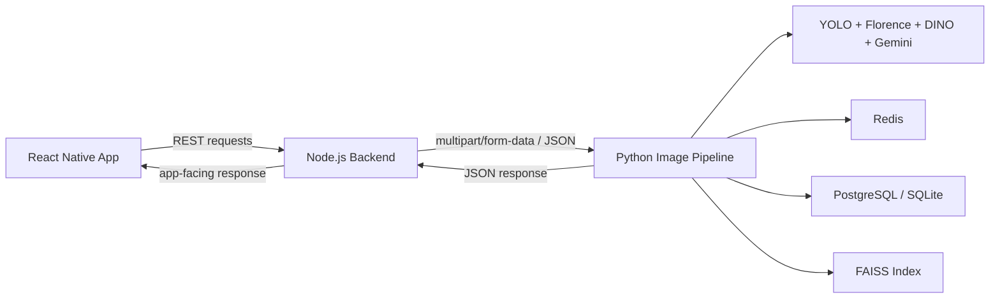
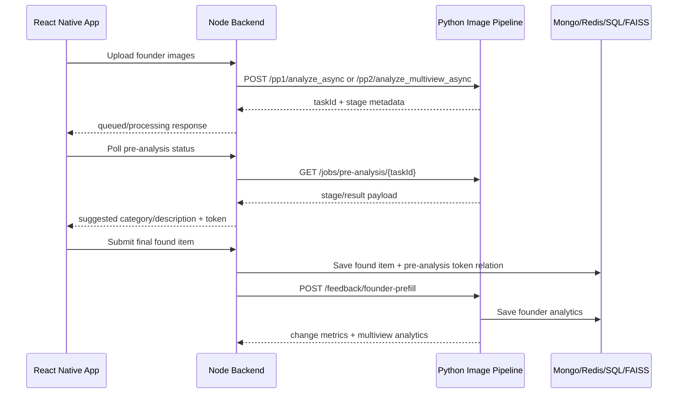
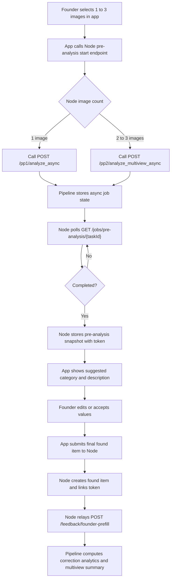

# Vision Core Backend for FindAssure

This service is the image processing and object recognition pipeline used by FindAssure. It is a FastAPI-based Python backend that performs single-image analysis, multi-view verification, vector embedding, image-based retrieval, and founder correction analytics for the lost-and-found workflow.

This README is the primary architecture and integration guide for:
- engineers working inside the Python pipeline
- full-stack developers working on the React Native app and Node backend
- project evaluators who need to understand how the image pipeline fits into the full system

## Project Purpose and Scope

The pipeline exists to solve four problems in the FindAssure system:
- analyze one uploaded image and generate a structured item profile
- verify whether two or three uploaded views belong to the same physical item
- store and search visual embeddings for later re-identification
- collect correction feedback when the founder edits the AI-suggested category or description

It is not the main public backend of the app. The React Native mobile app talks to the Node backend first, and the Node backend calls this pipeline as an internal service.

Primary responsibilities:
- PP1 single-image pre-analysis
- PP2 multi-view verification and fusion
- async pre-analysis jobs for the founder flow
- image-based vector search
- vector indexing for searchable items
- founder feedback analytics relay

Non-responsibilities:
- user authentication
- app session management
- lost-item semantic text search
- final business rules for item ownership and verification

## High-Level Architecture



At runtime the pipeline exposes a small set of endpoints on its own server, and the Node backend acts as the orchestrator:
- app uploads images to Node
- Node stores temp files and chooses PP1 or PP2
- Node calls the Python pipeline
- Python returns structured analysis or async task status
- Node persists app-facing pre-analysis tokens and found items
- Node relays founder correction analytics back to the pipeline after final item submission

## Technologies Used

### Runtime and framework

| Technology | Role in this service | Status |
| --- | --- | --- |
| Python 3 | Runtime for all pipeline logic | Core |
| FastAPI | HTTP API layer and dependency injection | Core |
| Uvicorn | ASGI server used by `run_server.py` | Core |
| Pydantic | Request and response validation | Core |
| pydantic-settings | Environment-backed settings | Core |
| python-dotenv | Loads local `.env` values | Core |

### ML and computer vision stack

| Technology | Why it is used | Where it sits in the flow | Status |
| --- | --- | --- | --- |
| PyTorch | Model execution runtime | All major model services | Core |
| Torchvision | Vision model utilities | Supporting model execution | Core |
| Ultralytics | YOLO object detection wrapper | Detection stage in PP1 and PP2 | Core |
| Transformers | Florence-2 and DINOv2 loading/inference | Captioning, OCR, VLM, embeddings | Core |
| OpenCV | ORB, RANSAC, geometric checks, quality signals | PP2 verification and image quality | Core |
| NumPy | Vector and matrix handling | Embeddings, FAISS, similarity logic | Core |
| scikit-learn | Similarity calculations | PP2 verification matrices | Core |
| FAISS | 128d vector indexing and nearest-neighbor search | Search and vector persistence | Core |

### Model components actually used

| Component | What it does | Status |
| --- | --- | --- |
| YOLOv8 fine-tuned weights | Detects item bounding boxes and categories | Core |
| Florence-2 local model | Captioning, OCR, VQA, grounding, attribute extraction | Core |
| DINOv2 | Generates embeddings for item similarity and indexing | Core |
| Gemini | Evidence-locked structured reasoning and description synthesis | Core but cloud-dependent |

### Components present but not primary

| Component | Current state |
| --- | --- |
| SwinIR | Present for image enhancement support, not the main decision engine |
| LightGlue weights | Present in the repo, not wired into the active request path |
| Qwen VLM service | Experimental service file exists, not the active production path |
| Siamese prototype | Prototype architecture exists, not integrated into the main API flow |

### Persistence, cache, and infrastructure

| Technology | Why it is used | Status |
| --- | --- | --- |
| SQLAlchemy | ORM for item evidence and feedback persistence | Core |
| PostgreSQL / SQLite | Relational storage depending on configured `DATABASE_URL` | Core |
| Redis | Cache and async job store when healthy | Core with fallback |
| In-memory job store | Fallback when Redis is unavailable for async pre-analysis jobs | Built-in resilience |

### Transport and integration

| Technology | Role |
| --- | --- |
| multipart/form-data | Image upload format between Node and the pipeline |
| Axios + FormData in Node | Internal HTTP client used by the Node backend |
| React Native app API calls | User-facing app calls go to Node, not directly to Python |

## Services, Models, and Infrastructure

### Main Python entrypoints

| Module | Responsibility |
| --- | --- |
| `app/main.py` | FastAPI app, PP1 routes, founder analytics relay, async job status |
| `app/core/lifespan.py` | Startup/shutdown lifecycle, model initialization, Redis and DB bootstrapping |
| `run_server.py` | Uvicorn server launcher |

### Core services

| Service | Responsibility |
| --- | --- |
| `app/services/unified_pipeline.py` | PP1 single-image orchestration |
| `app/services/pp2_multiview_pipeline.py` | PP2 multi-view orchestration |
| `app/services/pp2_multiview_verifier.py` | Pair scoring, pass/fail logic, used/dropped view selection |
| `app/services/pp2_geometric_verifier.py` | ORB and RANSAC geometric verification |
| `app/services/pp2_fusion_service.py` | Multi-view fusion of category, attributes, OCR, and description |
| `app/services/yolo_service.py` | Detection model wrapper |
| `app/services/florence_service.py` | Local VLM analysis, OCR, grounding, VQA |
| `app/services/dino_embedder.py` | 768d to 128d embedding generation |
| `app/services/gemini_reasoner.py` | Evidence-locked reasoning with Gemini |
| `app/services/storage_service.py` | SQL + Redis persistence for PP1 and PP2 results |
| `app/services/pre_analysis_job_store.py` | Async pre-analysis task storage in Redis or memory |
| `app/services/founder_prefill_analytics.py` | Founder correction metrics and multiview feedback analytics |

### Domain and schema helpers

| Module | Responsibility |
| --- | --- |
| `app/domain/category_specs.py` | Allowed labels plus feature/defect/attachment vocabularies |
| `app/domain/color_utils.py` | Color normalization and extraction |
| `app/schemas/pp2_schemas.py` | Typed PP2 response schema |
| `app/schemas/search_schemas.py` | Typed search and index response schema |

### Startup lifecycle

At startup the service:
1. ensures the `data/` directory exists
2. initializes Redis if available
3. creates SQLAlchemy tables and applies founder feedback schema compatibility updates
4. loads FAISS index state
5. initializes YOLO, Florence, DINO, Gemini, PP1, and PP2 services
6. stores the PP1 and PP2 orchestrators on `app.state`

At shutdown the service:
1. saves the FAISS index
2. clears application state
3. closes Redis

Server defaults from `run_server.py`:
- host: `0.0.0.0`
- port: `8002`
- reload: disabled unless enabled by env

## How the Mobile App, Node Backend, and Image Pipeline Connect

The app does not call the Python pipeline directly. The integration path is:
- React Native app calls the Node backend
- Node backend uploads temp images, chooses PP1 or PP2, and calls the pipeline
- pipeline returns structured results or async task progress
- Node converts that into app-facing state and persistence

### App -> Node -> Python integration map

App-side founder flow:
- image selection happens in `FindAssure/src/screens/founder/ReportFoundStartScreen.tsx`
- API calls are made from `FindAssure/src/api/itemsApi.ts`
- the app calls Node endpoints like `/items/pre-analyze-found-images/start` and `/items/pre-analyze-found-images/status/:taskId`

Node-side orchestration:
- `Backend/src/services/imageProcessingService.ts` is the internal HTTP client for this pipeline
- default pipeline base URL in Node is `http://127.0.0.1:8002`
- `Backend/src/controllers/itemController.ts` decides whether to call PP1 or PP2 and stores pre-analysis results under a token

Python-side execution:
- `app/main.py` exposes PP1 routes, async job status, and founder analytics relay
- `app/routers/pp2_router.py` exposes PP2 routes
- `app/routers/search_router.py` exposes FAISS vector indexing and image search routes



### Founder pre-analysis flow in detail



### Other integration path: owner image search

The Node backend also uses this pipeline for owner-side image-based narrowing:
- Node uploads the owner image to the pipeline via `POST /search/by-image`
- the pipeline generates one or more crop embeddings
- FAISS returns matching indexed vectors
- Node merges this with semantic text search results from the separate semantic engine

## Features and How They Work

### 1. Single-image pre-analysis (PP1)

Trigger:
- one founder image
- used by the Node pre-analysis flow and direct PP1 API calls

Main components:
- YOLO detection
- Florence analysis
- Gemini reasoning
- DINO embeddings
- StorageService

Key logic:
- validate exactly one image
- save temp file and convert HEIC if needed
- detect the best object crop
- run Florence captioning, OCR, and grounding
- run Gemini to synthesize a structured result
- generate 128d embeddings
- persist accepted results to SQL and Redis

Output:
- structured item analysis
- optional stored item record
- optional vector payload for Node-side indexing flow

Fallbacks:
- if Gemini is unavailable or transiently fails, PP1 can degrade to Florence-led output instead of hard-failing

### 2. Multi-view verification and fusion (PP2)

Trigger:
- two or three founder images

Main components:
- YOLO for each view
- Florence OCR-first extraction
- DINO embeddings per view
- geometric verifier
- multi-view verifier
- fusion service
- FAISS

Key logic:
- process each image as a view
- compute per-view quality and extraction results
- generate cosine-like and FAISS-based similarity evidence
- select the strongest eligible pair
- mark used views and dropped views
- verify same-item consistency
- if verification passes, fuse evidence into one profile and store it

Output:
- PP2 response with `per_view`, `verification`, `fused`, `faiss_ids`, and `stored`

Fallbacks:
- if verification fails, Node treats the result as manual fallback instead of surfacing a confident suggestion

### 3. Async founder pre-analysis jobs

Trigger:
- app founder flow uses async calls for both PP1 and PP2

Main components:
- background tasks
- `pre_analysis_job_store.py`
- Redis or in-memory fallback

Key logic:
- create a task id
- save stage payloads like `queued`, `detecting`, `reasoning`, `finalizing`
- update job state until complete, manual fallback, or failure

Output:
- `taskId`
- stage labels/messages
- final result payload when complete

Failure handling:
- if Redis is unavailable, job storage falls back to local in-memory state

### 4. Category and description suggestion

Trigger:
- founder pre-analysis

Main components:
- label normalization in `category_specs.py`
- Florence evidence extraction
- Gemini reasoning for PP1
- fusion service for PP2

Key logic:
- produce a canonical category from detected evidence
- generate a suggested public description from visual signals

Output:
- Node stores `detectedCategory`, `detectedDescription`, and `detectedColor` in a pre-analysis snapshot

### 5. OCR extraction

Trigger:
- PP1 and PP2 visual analysis

Main components:
- Florence OCR pipeline

Key logic:
- read visible text from crops
- return raw OCR text and structured OCR layout where available
- feed OCR into description generation, fusion, and later feedback analytics

Output:
- OCR text for captions, reasoning, and evidence storage

### 6. Color detection and normalization

Trigger:
- PP1 and PP2 analysis and founder feedback analytics

Main components:
- Florence VQA and caption evidence
- `color_utils.py`

Key logic:
- infer object color
- normalize variants like `navy` into canonical buckets like `blue`
- reuse normalized colors in PP2 checks and founder analytics

Output:
- normalized color in PP1/PP2 results
- stable color comparison metrics during founder feedback relay

### 7. Geometric verification

Trigger:
- PP2 verification and `/pp2/verify_pair`

Main components:
- OpenCV ORB keypoints
- RANSAC-based consistency checks

Key logic:
- compare crops from different views
- estimate whether they are visually consistent as the same object instance
- contribute pair-level evidence to PP2 verification

Output:
- pair-level geometric scores
- pass/fail support for the multiview verifier

### 8. Vector embedding generation

Trigger:
- PP1 crop analysis
- PP2 per-view processing
- image search

Main components:
- DINOv2 embedder

Key logic:
- generate feature vectors from cropped item images
- project or store in 128d form for FAISS operations

Output:
- vector embeddings for search and storage

### 9. FAISS indexing and image search

Trigger:
- Node indexes pre-analysis vectors with `POST /search/index_vector`
- Node searches by owner image with `POST /search/by-image`

Main components:
- DINOv2
- FAISS service
- search router

Key logic:
- indexing stores a vector plus metadata
- search performs multi-crop retrieval using YOLO crop, center crop, and full image
- results are deduplicated by FAISS id and grouped by item

Output:
- top matches with metadata, grouped vector hits, and scores

### 10. Founder correction analytics relay

Trigger:
- founder submits the final item after reviewing pre-analysis suggestions

Main components:
- Node feedback relay
- Python analytics service
- SQL founder feedback table

Key logic:
- Node sends predicted values, final values, and trimmed analysis evidence
- pipeline computes deterministic change metrics and multiview summaries
- pipeline stores analytics and returns them to Node

Output:
- change metrics
- comparison evidence
- multiview verification summary
- terminal log line for observability

### 11. Result storage and cache behavior

Trigger:
- accepted PP1 and successful PP2 flows

Main components:
- SQLAlchemy models
- Redis cache
- FAISS index

Key logic:
- PP1 stores an `ItemRecord`, one `ViewEvidence`, and an embedding row
- PP2 stores fused item data plus per-view evidence and a fused embedding row
- Redis caches compact item payloads for 24 hours

Output:
- relational persistence
- Redis item cache
- FAISS index updates when used

### 12. Degradation and fallback handling

Examples:
- Redis unavailable: async job store falls back to memory
- HEIC upload: convert to JPEG when possible
- PP1 degraded reasoning: Florence-led fallback can still produce an accepted result
- PP2 failed verification: Node returns manual fallback rather than a strong suggestion
- cache failure: Redis warnings do not abort SQL persistence

### 13. HEIC and HEIF support

Trigger:
- iPhone gallery uploads

Main components:
- `pillow-heif`
- temp file conversion path in `app/main.py`

Key logic:
- detect HEIC by header bytes, not just file extension
- convert to JPEG before PP1 or async processing

Output:
- downstream model stack always receives a standard RGB image

### 14. Per-view quality scoring and best-pair selection

Trigger:
- PP2 with 2 to 3 images

Main components:
- per-view extraction
- quality scoring
- verifier and pipeline pair selection logic

Key logic:
- compute quality per view
- select decision pair
- report `used_views` and `dropped_views`
- capture strong, near-miss, and weak pair evidence

Output:
- interpretable PP2 verification metadata

### 15. Debug observability

Current observability surfaces:
- startup and shutdown logs
- PP1 upload and conversion logs
- PP2 request start/end logs
- PP2 verification summary logs
- founder feedback analytics logs
- stored SQL feedback analytics payloads

This is intended for engineering visibility and admin/debug analysis, not for direct mobile UI display.

## API Endpoints Used by Other Services

| Endpoint | Caller | High-level input | Main output | Used in flow |
| --- | --- | --- | --- | --- |
| `GET /` | Internal health checks, developers | none | service health message | pipeline availability |
| `POST /pp1/analyze` | Node backend | one image file | immediate PP1 analysis result | sync founder pre-analysis |
| `POST /pp1/analyze_async` | Node backend | one image file | `taskId` + stage metadata | app founder async pre-analysis |
| `POST /pp2/analyze_multiview` | Node backend | two or three image files | PP2 response with verification and fusion | sync multi-view analysis |
| `POST /pp2/analyze_multiview_async` | Node backend | two or three image files | `taskId` + stage metadata | app founder async multi-view analysis |
| `POST /pp2/verify_pair` | available to internal callers | exactly two images | geometric + similarity verification | debugging or pair verification |
| `GET /jobs/pre-analysis/{task_id}` | Node backend | task id | async job status/result | app polling loop |
| `POST /search/index_vector` | Node backend | 128d vector + metadata | assigned `faiss_id` | make PP1 results searchable |
| `POST /search/by-image` | Node backend | image file + `top_k` + `min_score` + optional category | grouped image matches | owner image-based narrowing |
| `POST /feedback/founder-prefill` | Node backend | predicted vs final values + evidence | stored analytics + metrics | founder correction learning loop |

### Request style notes

- image routes use `multipart/form-data`
- vector indexing uses JSON
- founder feedback relay uses JSON
- Node-side caller is `Backend/src/services/imageProcessingService.ts`
- app-side caller remains the Node backend, not this Python service directly

## Data Persistence and Caching

### SQL storage

The pipeline persists:
- `ItemRecord`
- `ViewEvidence`
- `EmbeddingRecord`
- `FounderPrefillFeedbackRecord`

PP1 persistence:
- one image
- one view evidence row
- one embedding row

PP2 persistence:
- fused item profile
- multiple view evidence rows
- one fused embedding row

Founder feedback persistence:
- predicted and final values
- analysis evidence snapshot
- change metrics
- comparison evidence
- multiview verification summary

### Redis usage

Redis is used for:
- item cache with a 24-hour TTL
- async pre-analysis job storage when healthy

If Redis is unavailable:
- item persistence still succeeds through SQL
- async jobs fall back to in-memory storage

### FAISS usage

FAISS stores 128d vectors plus metadata and is used for:
- indexing PP1 pre-analysis vectors from Node
- retrieving similar items for owner image search

The index is loaded at startup and saved on shutdown.

## Startup and Configuration

### Installation

```bash
pip install -r requirements.txt
```

### Run locally

```bash
python run_server.py
```

Default server settings:
- host `0.0.0.0`
- port `8002`

### Important configuration areas

This service relies on environment-backed settings for:
- database connection
- FAISS paths
- Redis connection
- Gemini/API credentials
- pre-analysis retry and TTL values
- optional reload and worker settings via `run_server.py`

### Node backend expectation

The Node backend expects this service at:

```text
IMAGE_PIPELINE_URL=http://127.0.0.1:8002
```

If you change the host or port here, update the Node backend environment accordingly.

## Testing and Troubleshooting

### Tests

The repo includes pytest-based tests for major PP1, PP2, schema, fusion, and router behavior under `tests/`.

Typical command:

```bash
python -m pytest
```

### Things to verify first when debugging

1. The pipeline is running on port `8002`.
2. The Node backend points to the same `IMAGE_PIPELINE_URL`.
3. Redis availability if async jobs seem to disappear.
4. Database connectivity if storage fails.
5. Model files exist in `app/models/`.
6. `pillow-heif` is installed if iPhone images fail.
7. Gemini credentials are present if PP1 reasoning quality unexpectedly degrades.

### Common failure patterns

| Symptom | Likely cause |
| --- | --- |
| Node times out calling the pipeline | service down, wrong port, heavy model startup, or long inference |
| Founder polling returns 404 | async job expired or wrong task id |
| HEIC uploads fail | `pillow-heif` missing or conversion error |
| Search returns no matches | vector not indexed, category filter too strict, or low similarity |
| PP2 falls back manually | view mismatch, weak pair evidence, or verification failure |
| Feedback analytics not stored | database issue or relay request failure from Node |

## Final Notes

This Python service is one part of the broader FindAssure system:
- the React Native app owns the user experience
- the Node backend owns orchestration and business logic
- this pipeline owns visual analysis, verification, embedding, retrieval, and correction analytics

If you need the end-to-end product picture, read the system documentation at the repository root as the complement to this pipeline-specific guide. This README is intended to be complete enough to understand and operate the image pipeline without needing the older `OVERVIEW.md`.
